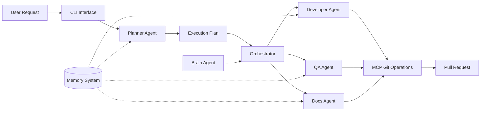
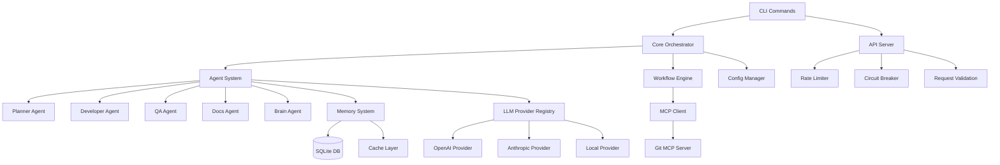

# SupaDupa-Coding — Architecture Documentation

**Branch:** `copilot/generate-standardized-documentation`  
**Last Updated:** 2026-01-21  
**Status:** 🟢 Active Development (Core features implemented, ~75% complete)

---

## 📋 Purpose

SupaDupa-Coding is a **multi-agent orchestration system** that automates software development workflows using specialized AI agents. It enables:

- **Automated Planning**: Decompose complex requirements into actionable tasks
- **Code Generation**: Implement features with specialized developer agents
- **Quality Assurance**: Automated testing and code review
- **Documentation**: Maintain up-to-date documentation automatically
- **Git Integration**: Autonomous commits, branches, and PR management via MCP (Model Context Protocol)
- **Memory Management**: Share context and decisions across agents through a unified memory system

---

## 🏗️ High-Level Architecture

### Main Workflow (End-to-End)



### Component Dependencies



---

## 📁 Project Structure Map

```
SupaDupa-Coding/
├── cli/                          # Main CLI application
│   ├── src/
│   │   ├── agents/              # AI agent implementations (Planner, Dev, QA, Docs, Brain)
│   │   ├── api/                 # REST API server + LLM provider integrations
│   │   ├── commands/            # CLI command handlers (plan, run, review, etc.)
│   │   ├── core/                # Core orchestration and configuration management
│   │   ├── workflow/            # Workflow execution engine with checkpointing
│   │   ├── mcp/                 # Model Context Protocol integration (Git operations)
│   │   ├── memory/              # Shared memory system with SQLite backend
│   │   ├── git/                 # Git operations (branch, commit management)
│   │   ├── tools/               # Utility tools (file, search operations)
│   │   ├── security/            # Encryption and security utilities
│   │   ├── ui/                  # CLI progress bars and user interface
│   │   ├── utils/               # Logging, retry logic, metrics
│   │   ├── index.ts             # Main CLI entry point
│   │   └── api-server.ts        # API server entry point
│   ├── tests/                   # Test suite (unit, integration tests)
│   ├── examples/                # Example usage scripts
│   ├── data/seed/               # Database seed data
│   ├── prompts/                 # System prompts for agents
│   ├── planner/output/          # Generated execution plans
│   ├── workflow/reports/        # Workflow execution reports
│   └── package.json             # Dependencies and scripts
├── shared/                       # Shared contracts and utilities
│   ├── contracts/               # TypeScript interfaces (plan, workflow, memory schemas)
│   ├── events/                  # Event emitter for system events
│   └── utils/                   # Shared utility functions
├── docs/                         # Project documentation
│   ├── imp-plan.md              # Detailed implementation roadmap
│   ├── MVP.md                   # MVP specifications
│   └── archive/                 # Historical documentation
└── README.md                     # Main project README
```

### Key Directories

- **agents/**: Specialized AI agents with distinct roles (planning, coding, testing, documentation)
- **api/**: REST API + provider registry for multiple LLM providers (OpenAI, Anthropic, local models)
- **memory/**: SQLite-based memory system enabling context sharing between agents
- **workflow/**: Checkpoint-based workflow execution with state management
- **mcp/**: Model Context Protocol client for autonomous Git operations
- **commands/**: CLI command implementations for user interaction

---

## 🧠 Key Concepts

### Multi-Agent System
- **Planner Agent**: Analyzes requirements and creates execution plans (task decomposition)
- **Developer Agent**: Implements code changes based on plan steps
- **QA Agent**: Runs tests and validates implementations
- **Docs Agent**: Updates and maintains documentation
- **Brain Agent**: Provides decision-making, context management, and cross-agent coordination

### Memory System
- **Shared Memory**: SQLite database storing agent decisions, artifacts, and context
- **Cross-Agent Access**: Agents can read from shared memory with permission controls
- **Caching Layer**: In-memory cache for frequently accessed data
- **Analytics**: Track memory usage patterns and performance metrics

### Workflow Execution
- **Checkpointing**: Save/restore workflow state for resilience
- **Dependency Resolution**: Execute tasks based on dependency graphs
- **State Management**: Track task status (pending, running, completed, failed)
- **Error Recovery**: Retry logic and graceful failure handling

### Model Context Protocol (MCP)
- **Autonomous Git Operations**: Agents can commit, branch, and create PRs
- **Tool Registry**: Filesystem, Git, and database tools available to agents
- **Permission Model**: Fine-grained control over agent capabilities

### Provider Registry
- **Multi-Provider Support**: OpenAI, Anthropic, local models (Ollama)
- **Failover**: Automatic fallback to backup providers
- **Circuit Breaker**: Protect against cascading failures
- **Rate Limiting**: Prevent API quota exhaustion

---

## 🚪 Entry Points

### CLI Entry Point
- **File**: `cli/src/index.ts`
- **Binary**: `cli/bin/sd.js` (alias: `sd`)
- **Main Command**: `supadupacode` (global after `npm link`)
- **Run**: `npm run start` or `node dist/src/index.js`

### API Server Entry Point
- **File**: `cli/src/api-server.ts`
- **Run Dev**: `npm run start:api` (uses ts-node)
- **Run Prod**: `npm run start:api:prod` (compiled)
- **Default Port**: 3000 (configurable via `API_PORT` env var)

### Test Entry Points
- **Unit Tests**: `npm test` (runs all `tests/**/*.test.js`)
- **Integration Tests**: `npm run example:planner`, `npm run example:api`
- **Watch Mode**: `npm run test:watch`

### Build Entry Points
- **Build**: `npm run build` (uses `tsconfig.build.json`)
- **Watch**: `npm run build:watch`
- **Type Check**: `npm run type-check`

---

## 💾 Data Model

### Memory System (SQLite)

#### Tables

**memory_records**
- Stores agent memory entries
- Fields: `record_id`, `key`, `category`, `data` (JSON), `agent_origin`, `embedding_vector`, `metadata`, `created_at`, `updated_at`
- Indexed by: key, category, agent_origin, created_at

**memory_permissions**
- Controls cross-agent memory access
- Fields: `record_id`, `agent_id`, `permissions` (JSON), `granted_at`, `granted_by`
- Unique constraint on (record_id, agent_id)

### Execution Plans (JSON)

**PlannerPlanDTO**
- `planId`: Unique identifier
- `description`: High-level plan summary
- `steps`: Array of PlannerStepDTO
- `metadata`: Timestamps, version, priority

**PlannerStepDTO**
- `id`: Step identifier
- `type`: analysis | design | implementation | quality-assurance | governance
- `agent`: Responsible agent name
- `dependencies`: Array of prerequisite step IDs
- `expectedOutputs`: Deliverables list

### Workflow State (JSON)

**WorkflowCheckpoint**
- `checkpointId`: Unique identifier
- `workflowId`: Parent workflow reference
- `state`: Current execution state
- `completedTasks`: Array of task IDs
- `pendingTasks`: Array of task IDs
- `timestamp`: Checkpoint creation time

---

## 🛠️ Tech Stack

### Runtime & Language
- **Node.js**: 16+ (JavaScript/TypeScript runtime)
- **TypeScript**: 5.3.3 (Static typing)

### CLI Framework
- **Commander**: Command-line interface framework
- **Inquirer**: Interactive prompts
- **Chalk**: Terminal styling
- **Ora**: Elegant spinners
- **cli-progress**: Progress bars

### API & Web
- **Express**: REST API server (v5.1.0)
- **CORS**: Cross-origin resource sharing
- **WebSocket (ws)**: Real-time communication

### LLM Providers
- **OpenAI API**: GPT-4 and other models
- **Anthropic API**: Claude models (3.5 Sonnet)
- **Local (Ollama)**: Self-hosted models (Llama3)

### Database & Storage
- **SQLite3**: Embedded database for memory system
- **File System**: Plan storage, checkpoints, logs

### Validation & Schema
- **AJV**: JSON Schema validation
- **TypeScript interfaces**: Compile-time type safety

### Testing
- **Node Test Runner**: Built-in test framework
- **ts-node**: TypeScript execution for tests

### Development Tools
- **ESLint**: Code linting
- **TypeScript Compiler**: Build system
- **Rimraf**: Cross-platform file cleanup

### Infrastructure
- **Git**: Version control
- **MCP Servers**: Model Context Protocol for tool integration
- **Environment Variables**: Configuration via `.env`

---

## ✅ Implemented Features

- [x] **CLI Framework**
  - [x] Command parsing and routing (Commander)
  - [x] Interactive prompts and user input
  - [x] Progress indicators and status displays
  - [x] Global binary installation (`supadupacode` command)

- [x] **Planner Agent**
  - [x] Task decomposition from requirements
  - [x] Execution plan generation (JSON output)
  - [x] Dependency graph creation
  - [x] Queue-based task management

- [x] **Developer Agent**
  - [x] Code implementation based on plans
  - [x] File modification tracking
  - [x] Integration with MCP Git tools

- [x] **QA Agent**
  - [x] Test execution and result reporting
  - [x] Quality gate validation

- [x] **Docs Agent**
  - [x] Documentation generation and updates

- [x] **Brain Agent**
  - [x] Decision-making and context management
  - [x] Cross-agent coordination

- [x] **Memory System**
  - [x] SQLite database setup (migrations)
  - [x] CRUD operations for memory records
  - [x] Cross-agent memory sharing
  - [x] Permission management
  - [x] Caching layer
  - [x] Memory analytics and health checks

- [x] **API Server**
  - [x] REST endpoints for plan creation
  - [x] Rate limiting and circuit breaker
  - [x] Request validation middleware
  - [x] CORS support
  - [x] WebSocket support for real-time updates

- [x] **Provider Registry**
  - [x] OpenAI provider integration
  - [x] Anthropic provider integration
  - [x] Local provider (Ollama) support
  - [x] Failover and fallback logic
  - [x] Model detection and configuration

- [x] **Workflow Engine**
  - [x] Checkpoint-based state management
  - [x] Task queue and execution
  - [x] Dependency resolution
  - [x] Workflow runner with error handling

- [x] **MCP Integration**
  - [x] MCP client implementation
  - [x] Git MCP server integration
  - [x] Tool registry and invocation

- [x] **Git Operations**
  - [x] Branch management
  - [x] Commit creation
  - [x] Status checking

- [x] **Configuration Management**
  - [x] Unified config system
  - [x] Environment variable support
  - [x] Agent-specific configuration
  - [x] Provider configuration

- [x] **Security**
  - [x] Encryption utilities
  - [x] API key management

- [x] **Testing Infrastructure**
  - [x] Unit test suite
  - [x] Integration test examples
  - [x] Test commands in package.json

---

## 🚧 In Development / TODO

### High Priority
- [ ] PR review automation (GitHub API integration) - `commands/review.ts` has TODO
- [ ] Fix command implementation (issue detection + auto-fix) - `commands/fix.ts` has TODOs
- [ ] Memory compression - `checkpoint-manager.ts` has TODO
- [ ] Resource tracking (memory/CPU usage per agent) - `base-agent.ts` has TODOs

### Medium Priority
- [ ] AI-based task decomposition in orchestrator - `core/orchestrator.ts` has TODOs
- [ ] Fine-grained MCP permission checking - `mcp/mcp-client.ts` has TODO
- [ ] File modification tracking in Developer Agent - `developer-agent.ts` has TODO
- [ ] Status tracking dashboard - `core/orchestrator.ts` has TODO
- [ ] Confirmation prompts for destructive operations - `commands/config.ts` has TODO

### Nice to Have
- [ ] End-to-end encrypted memory records
- [ ] Multi-repository support
- [ ] Agent marketplace / plugin system
- [ ] Advanced analytics and observability
- [ ] Cost tracking per operation

### Based on Codebase Analysis
- [ ] Complete example workflows in `examples/`
- [ ] Add more comprehensive test coverage
- [ ] Documentation for custom agent creation
- [ ] Performance benchmarks

---

## 🎨 Design Patterns

### Event-Driven Architecture
**Evidence**: `shared/events/event-emitter.ts`, system-wide EventEmitter  
**Justification**: Decouples components; agents emit events (PLAN_CREATED, PLAN_FAILED) for monitoring and orchestration

### Repository Pattern
**Evidence**: `memory/memory-repository.ts`  
**Justification**: Abstracts data access; separates business logic from SQLite operations

### Provider Pattern (Strategy)
**Evidence**: `api/provider-registry.ts`, `api/providers/base-provider.ts`  
**Justification**: Supports multiple LLM providers with pluggable implementations; runtime provider switching

### Circuit Breaker Pattern
**Evidence**: `api/circuit-breaker.ts`  
**Justification**: Prevents cascading failures when external APIs (OpenAI, Anthropic) are unavailable

### Checkpoint Pattern
**Evidence**: `workflow/checkpoint-manager.ts`  
**Justification**: Enables workflow resume after failures; state persistence for long-running tasks

### Queue Pattern
**Evidence**: `agents/planner/queue.ts`, `workflow/utils/task-queue.ts`  
**Justification**: Manages task execution order and concurrency; implements dependency resolution

### Singleton Pattern
**Evidence**: `core/unified-config-manager.ts`, `memory/index.ts`  
**Justification**: Single source of truth for configuration and memory; prevents state inconsistencies

### Factory Pattern
**Evidence**: `api/providers/` directory structure  
**Justification**: Creates provider instances based on configuration; simplifies provider instantiation

### Decorator Pattern (Middleware)
**Evidence**: `api/middleware/validation.ts`, rate-limiter, circuit-breaker  
**Justification**: Adds cross-cutting concerns (validation, rate limiting) without modifying core logic

---

## 🧭 How to Navigate the Code

### Recommended Reading Order

1. **Start Here**: `README.md` → `docs/imp-plan.md`
2. **Entry Points**: `cli/src/index.ts` (CLI) → `cli/src/api-server.ts` (API)
3. **Core Orchestration**: `cli/src/core/unified-config-manager.ts` → `cli/src/core/orchestrator.ts` (TODO-heavy)
4. **Agent System**: `cli/src/agents/base-agent.ts` → specific agents (planner, developer, qa, docs, brain)
5. **Planner Deep Dive**: `cli/src/agents/planner/plan-orchestrator.ts` → `queue.ts`
6. **Memory System**: `cli/src/memory/index.ts` → `memory-repository.ts` → `migrations/001-initial-schema.sql`
7. **API Layer**: `cli/src/api/server.ts` → `provider-registry.ts` → `providers/base-provider.ts`
8. **Workflow Engine**: `cli/src/workflow/workflow-runner.ts` → `checkpoint-manager.ts` → `task-executor.ts`
9. **MCP Integration**: `cli/src/mcp/mcp-client.ts` → `servers/git-server.ts`
10. **Contracts**: `shared/contracts/plan-schema.ts` → other schemas

### For Specific Tasks

- **Adding a new agent**: Read `agents/base-agent.ts`, then copy pattern from existing agents
- **New LLM provider**: Implement `api/providers/base-provider.ts` interface
- **New CLI command**: Add to `commands/`, register in `index.ts`
- **Memory operations**: Check `memory/index.ts` and `memory-repository.ts`
- **Workflow modifications**: Start with `workflow/workflow-runner.ts`

---

## 📐 Code Conventions

### TypeScript Style
- **Strict Mode**: Enabled via `tsconfig.json`
- **Interfaces over Types**: Use `interface` for contracts (see `shared/contracts/`)
- **Explicit Return Types**: Required for public functions
- **Null Safety**: Use optional chaining (`?.`) and nullish coalescing (`??`)

### Async Patterns
- **Async/Await**: Preferred over raw Promises
- **Error Handling**: Try-catch blocks with typed errors
- **Promise.all**: Used for parallel operations where safe
- **Retry Logic**: Implemented via `utils/retry.ts` for flaky operations

### Logging
- **Logger Utility**: `utils/logger.ts`
- **Log Levels**: error, warn, info, debug
- **Structured Logging**: JSON format for production
- **Context**: Include agent name, operation, timestamp

### Validation
- **AJV Schemas**: JSON Schema validation for API requests
- **TypeScript Guards**: Runtime type checking where needed
- **Input Sanitization**: Required for all user inputs

### Error Handling
- **Custom Errors**: Typed error classes for different failure modes
- **Error Propagation**: Re-throw with context, don't swallow errors
- **Circuit Breaker**: Fail fast for external service errors
- **Graceful Degradation**: Fallback to defaults when possible

### Configuration
- **Environment Variables**: Defined in `.env.example`
- **Config Schema**: Validated via `core/config-schema.ts`
- **Defaults**: Always provide sensible defaults
- **Secrets**: Never commit API keys; use `.env` (gitignored)

### File Organization
- **Index Files**: Re-export public APIs (e.g., `memory/index.ts`)
- **Single Responsibility**: One class per file
- **Naming**: PascalCase for classes, camelCase for functions, kebab-case for files
- **Prefixes**: `sd*` prefix for custom classes (e.g., `sdPlannerAgent`)

---

## 🧪 Testing

### Test Commands
```bash
# Run all tests
npm test

# Watch mode (rebuilds on change)
npm run test:watch

# Type checking before tests
npm run type-check

# Linting before tests
npm run lint:check

# Integration examples
npm run example:planner    # Planner integration test
npm run example:api        # API integration test
npm run example:e2e        # End-to-end workflow
```

### Test Coverage

**Unit Tests** (`tests/*.test.ts`)
- Agent initialization and lifecycle
- Memory CRUD operations
- Provider registry and failover
- Branch/commit manager
- Validation middleware
- Retry logic
- Authentication

**Integration Tests** (`tests/integration/*.test.ts`, `tests/*-integration.test.js`)
- Planner + memory integration
- API server + provider registry
- Workflow execution
- MCP tool invocation

**Example Scripts** (`examples/*.ts`)
- End-to-end workflow demonstration
- Manual testing harness

### Testing Strategy
- **Mocks**: In-memory SQLite for memory tests
- **Stubs**: Fake LLM responses for provider tests
- **Fixtures**: Seed data in `data/seed/`
- **Coverage Goal**: 70%+ for core modules (not enforced yet)

---

## 🏛️ Architectural Decisions (ADRs)

### ADR-1: SQLite for Memory System
**Context**: Agents need to share context and decisions across sessions  
**Decision**: Use SQLite as embedded database instead of external DB (PostgreSQL/MongoDB)  
**Consequences**:
- ✅ Zero configuration; single file deployment
- ✅ ACID guarantees for memory operations
- ✅ Fast local reads/writes
- ❌ Limited to single machine (not distributed)
- ❌ No advanced full-text search (requires extensions)

### ADR-2: Model Context Protocol (MCP) for Git Operations
**Context**: Agents need autonomous Git operations without shell commands  
**Decision**: Integrate MCP servers for structured, permission-controlled tool access  
**Consequences**:
- ✅ Standardized tool interface across agents
- ✅ Fine-grained permission model
- ✅ Better error handling than shell exec
- ❌ Additional abstraction layer
- ❌ Dependency on MCP server implementations

### ADR-3: Multi-Provider LLM Support
**Context**: Avoid vendor lock-in and support cost optimization  
**Decision**: Build provider registry with pluggable implementations  
**Consequences**:
- ✅ Flexibility to switch providers based on cost/performance
- ✅ Failover for reliability
- ✅ Support for local/self-hosted models
- ❌ Complexity in maintaining multiple provider integrations
- ❌ Inconsistent response formats require normalization

### ADR-4: Checkpoint-Based Workflow Execution
**Context**: Long-running workflows may fail mid-execution  
**Decision**: Implement checkpoint pattern to save/restore workflow state  
**Consequences**:
- ✅ Resume workflows after crashes
- ✅ Idempotent task execution
- ✅ Audit trail of execution progress
- ❌ Storage overhead for checkpoints
- ❌ Complexity in state management

### ADR-5: TypeScript for CLI and API
**Context**: Need type safety and modern tooling for complex orchestration logic  
**Decision**: Use TypeScript instead of plain JavaScript  
**Consequences**:
- ✅ Compile-time type checking prevents runtime errors
- ✅ Better IDE support and autocomplete
- ✅ Contracts via shared interfaces
- ❌ Build step required (slower development iteration)
- ❌ Learning curve for contributors

### ADR-6: Event-Driven Architecture
**Context**: Multiple agents need to react to system events (plan created, task completed)  
**Decision**: Use EventEmitter for cross-component communication  
**Consequences**:
- ✅ Loose coupling between components
- ✅ Easy to add new listeners without modifying emitters
- ✅ Aligns with Node.js ecosystem patterns
- ❌ Event flow harder to trace
- ❌ No compile-time guarantees on event contracts

### ADR-7: Circuit Breaker for External APIs
**Context**: External LLM APIs may experience outages or rate limits  
**Decision**: Implement circuit breaker pattern to fail fast  
**Consequences**:
- ✅ Prevents cascade failures and resource exhaustion
- ✅ Automatic recovery when service is restored
- ✅ Improves user experience with faster error feedback
- ❌ Requires tuning thresholds for different services
- ❌ May reject valid requests during recovery period

---

## 🚀 Next Steps (Prioritized)

### 1. Complete Critical TODOs (High Impact)
- Implement PR review automation in `commands/review.ts` (GitHub API integration)
- Build issue detection + auto-fix in `commands/fix.ts`
- Add AI-based task decomposition in `core/orchestrator.ts`

### 2. Enhance Observability (Medium Impact)
- Resource tracking (memory/CPU per agent) in `base-agent.ts`
- Status tracking dashboard for orchestrator
- Comprehensive metrics collection

### 3. Testing & Documentation (Medium Impact)
- Increase test coverage to 80%+ (especially workflow, memory, providers)
- Add inline JSDoc for all public APIs
- Create architecture decision records (ADR) for future decisions

### 4. Performance Optimization (Medium Impact)
- Implement memory compression in checkpoint manager
- Optimize SQLite queries (analyze with EXPLAIN)
- Add connection pooling for API server

### 5. Developer Experience (Low-Medium Impact)
- Add confirmation prompts for destructive operations
- Improve error messages with actionable suggestions
- Create plugin/extension system for custom agents

### 6. Security Hardening (High Priority)
- Fine-grained MCP permission checking
- Audit logging for all agent actions
- Secret rotation mechanism

### 7. Scalability (Future)
- Multi-repository support
- Distributed workflow execution (worker nodes)
- Agent result caching across sessions

---

**Document maintained by**: Auto-generated via standardized documentation process  
**Review cycle**: Update on major architectural changes or quarterly
