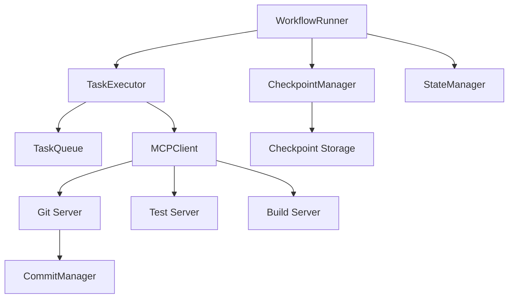
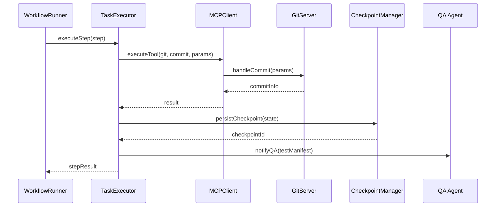

# Dev 4: Workflow & MCP Implementation Plan

## Role: Workflow & MCP Developer (170 IQ Code Orchestrator)

You are responsible for implementing the Workflow execution engine and MCP (Model Context Protocol) integration according to `docs/imp-plan.md` specifications.

---

## 📋 Responsibilities Overview

### Main Folders
- **`cli/src/workflow/`** - Workflow execution engine
- **`cli/src/mcp/`** - MCP client and servers

### Core Functions
- [`WorkflowRunner`](cli/src/workflow/workflow-runner.ts:1) with [`runStep()`](cli/src/workflow/workflow-runner.ts:50) and [`persistCheckpoint()`](cli/src/workflow/workflow-runner.ts:100)
- Standardized commits via MCP endpoint [`mcp/git/commit`](cli/src/mcp/servers/git-server.ts:1)
- Result reporting in [`workflow/reports/run-summary.json`](cli/workflow/reports/run-summary.json:1)
- Automation scripts in [`scripts/workflow/run-checkpoint.ps1`](cli/scripts/workflow/run-checkpoint.ps1:1)

---

## 🎯 Expected Artifacts

### Workflow Module
1. [`cli/src/workflow/workflow-runner.ts`](cli/src/workflow/workflow-runner.ts:1) - Main workflow engine
2. [`cli/src/workflow/checkpoint-manager.ts`](cli/src/workflow/checkpoint-manager.ts:1) - State persistence
3. [`cli/src/workflow/task-executor.ts`](cli/src/workflow/task-executor.ts:1) - Task execution
4. [`cli/src/workflow/utils/task-queue.ts`](cli/src/workflow/utils/task-queue.ts:1) - Task queue management
5. [`cli/src/workflow/utils/state-manager.ts`](cli/src/workflow/utils/state-manager.ts:1) - State management

### MCP Module
1. [`cli/src/mcp/mcp-client.ts`](cli/src/mcp/mcp-client.ts:1) - MCP client with WebSocket
2. [`cli/src/mcp/servers/git-server.ts`](cli/src/mcp/servers/git-server.ts:1) - Git operations server
3. [`cli/src/mcp/servers/filesystem-server.ts`](cli/src/mcp/servers/filesystem-server.ts:1) - File operations
4. [`cli/src/mcp/servers/test-server.ts`](cli/src/mcp/servers/test-server.ts:1) - Test execution
5. [`cli/src/mcp/servers/build-server.ts`](cli/src/mcp/servers/build-server.ts:1) - Build operations
6. [`cli/src/mcp/utils/message-handler.ts`](cli/src/mcp/utils/message-handler.ts:1) - Message handling
7. [`cli/src/mcp/utils/protocol-validator.ts`](cli/src/mcp/utils/protocol-validator.ts:1) - Protocol validation

### Output Files
1. [`cli/workflow/reports/run-summary.json`](cli/workflow/reports/run-summary.json:1) - Workflow execution summary
2. [`cli/data/checkpoints/`](cli/data/checkpoints/:1) - Checkpoint storage directory
3. [`cli/qa/input/test_manifest.json`](cli/qa/input/test_manifest.json:1) - QA notification manifest

### Scripts
1. [`cli/scripts/workflow/run-checkpoint.ps1`](cli/scripts/workflow/run-checkpoint.ps1:1) - PowerShell automation

### Contracts
1. [`cli/shared/contracts/workflow-schema.ts`](cli/shared/contracts/workflow-schema.ts:1) - Workflow interfaces
2. [`cli/shared/contracts/mcp-protocol.ts`](cli/shared/contracts/mcp-protocol.ts:1) - MCP protocol types
3. [`cli/shared/contracts/checkpoint-schema.ts`](cli/shared/contracts/checkpoint-schema.ts:1) - Checkpoint types

---

## 🔗 Synchronization Points

### Inputs
- **From Planner**: [`planner/output/plan_v1.json`](cli/planner/output/plan_v1.json:1)
- **From Coder**: [`coder/build/patchset_*.diff`](cli/coder/build/:1)
- **From Memory**: Cached solutions and context

### Outputs
- **To QA**: [`qa/input/test_manifest.json`](cli/qa/input/test_manifest.json:1)
- **To Memory**: Execution history and checkpoints
- **Final Report**: [`workflow/reports/run-summary.json`](cli/workflow/reports/run-summary.json:1)

### Checkpoint Persistence
- **Storage Path**: [`data/checkpoints/checkpoint_{timestamp}.json`](cli/data/checkpoints/:1)
- **Database**: Optional SQLite integration with Memory module

---

## 🏗️ Architecture Design

### Workflow Engine Architecture



### Data Flow



---

## 📦 Required Dependencies

Add to [`cli/package.json`](cli/package.json:1):

```json
{
  "dependencies": {
    "ws": "^8.14.2",
    "sqlite3": "^5.1.6",
    "uuid": "^9.0.1"
  },
  "devDependencies": {
    "typescript": "^5.3.3",
    "@types/node": "^20.10.0",
    "@types/ws": "^8.5.9",
    "@types/uuid": "^9.0.7"
  }
}
```

---

## 🎨 Naming Conventions (STRICT)

### Class Prefixes
- `sdWorkflowRunner` - Main workflow engine
- `sdCheckpointManager` - Checkpoint management
- `sdTaskExecutor` - Task execution
- `sdMCPClient` - MCP client
- `sdGitServer` - Git MCP server
- `sdFilesystemServer` - Filesystem MCP server
- `sdTestServer` - Test MCP server
- `sdBuildServer` - Build MCP server

### Variable Prefixes
- `WORKFLOW_*` - Workflow constants
- `MCP_*` - MCP constants
- `CHECKPOINT_*` - Checkpoint constants

### Event Names
- `SD_EVENT_WORKFLOW_STARTED`
- `SD_EVENT_WORKFLOW_COMPLETED`
- `SD_EVENT_CHECKPOINT_CREATED`
- `SD_EVENT_STEP_EXECUTED`
- `SD_EVENT_MCP_CONNECTED`

---

## 📝 Implementation Details

### 1. Shared Contracts

#### [`shared/contracts/workflow-schema.ts`](cli/shared/contracts/workflow-schema.ts:1)

```typescript
export interface WorkflowStepDTO {
  id: string;
  name: string;
  type: 'planning' | 'coding' | 'testing' | 'review';
  agent: string;
  description: string;
  dependencies: string[];
  expectedOutputs: string[];
  status: 'pending' | 'running' | 'completed' | 'failed';
  startedAt?: string;
  completedAt?: string;
  error?: string;
}

export interface WorkflowExecutionDTO {
  workflowId: string;
  planId: string;
  steps: WorkflowStepDTO[];
  currentStepIndex: number;
  status: 'pending' | 'running' | 'completed' | 'failed' | 'paused';
  startedAt: string;
  completedAt?: string;
  checkpoints: string[];
  artifacts: string[];
  metadata: {
    totalSteps: number;
    completedSteps: number;
    failedSteps: number;
    estimatedDuration: number;
    actualDuration?: number;
  };
}

export interface WorkflowSummaryDTO {
  workflowId: string;
  planId: string;
  status: 'completed' | 'failed' | 'partial';
  duration: number;
  agents: string[];
  artifacts: string[];
  checkpoints: string[];
  steps: {
    total: number;
    completed: number;
    failed: number;
  };
  success: boolean;
  timestamp: string;
}
```

#### [`shared/contracts/checkpoint-schema.ts`](cli/shared/contracts/checkpoint-schema.ts:1)

```typescript
export interface CheckpointDTO {
  checkpointId: string;
  workflowId: string;
  stepId: string;
  timestamp: string;
  state: {
    currentStepIndex: number;
    completedSteps: string[];
    pendingSteps: string[];
    artifacts: string[];
    context: Record<string, any>;
  };
  metadata: {
    agentId: string;
    duration: number;
    memoryUsage: number;
  };
}

export interface CheckpointRestoreDTO {
  checkpointId: string;
  workflowId: string;
  restored: boolean;
  state: CheckpointDTO['state'];
  timestamp: string;
}
```

#### [`shared/contracts/mcp-protocol.ts`](cli/shared/contracts/mcp-protocol.ts:1)

```typescript
export interface MCPMessage {
  id: string;
  method: string;
  params?: Record<string, any>;
  result?: any;
  error?: {
    code: number;
    message: string;
    data?: any;
  };
}

export interface MCPServerConfig {
  name: string;
  endpoint: string;
  enabled: boolean;
  tools: MCPTool[];
  capabilities: string[];
  permissions: string[];
}

export interface MCPTool {
  name: string;
  description: string;
  parameters: {
    name: string;
    type: string;
    required: boolean;
    description: string;
  }[];
}

export interface MCPCommitParams {
  agent: string;
  scope: string;
  description: string;
  files?: string[];
  autoStage?: boolean;
}

export interface MCPCommitResult {
  commitHash: string;
  branch: string;
  files: string[];
  message: string;
  timestamp: string;
}
```

### 2. Workflow Runner Implementation

#### [`cli/src/workflow/workflow-runner.ts`](cli/src/workflow/workflow-runner.ts:1)

```typescript
import { EventEmitter } from 'events';
import { WorkflowExecutionDTO, WorkflowStepDTO, WorkflowSummaryDTO } from '../../shared/contracts/workflow-schema';
import { sdCheckpointManager } from './checkpoint-manager';
import { sdTaskExecutor } from './task-executor';
import { sdStateManager } from './utils/state-manager';

export class sdWorkflowRunner extends EventEmitter {
  private checkpointManager: sdCheckpointManager;
  private taskExecutor: sdTaskExecutor;
  private stateManager: sdStateManager;
  private currentExecution: WorkflowExecutionDTO | null = null;
  
  constructor(config: any) {
    super();
    this.checkpointManager = new sdCheckpointManager(config.checkpointPath);
    this.taskExecutor = new sdTaskExecutor(config);
    this.stateManager = new sdStateManager();
  }

  async initialize(): Promise<void> {
    await this.checkpointManager.initialize();
    await this.taskExecutor.initialize();
  }

  async runWorkflow(planId: string, steps: WorkflowStepDTO[]): Promise<WorkflowSummaryDTO> {
    const workflowId = this.generateWorkflowId();
    const startTime = Date.now();

    this.currentExecution = {
      workflowId,
      planId,
      steps,
      currentStepIndex: 0,
      status: 'running',
      startedAt: new Date().toISOString(),
      checkpoints: [],
      artifacts: [],
      metadata: {
        totalSteps: steps.length,
        completedSteps: 0,
        failedSteps: 0,
        estimatedDuration: this.estimateDuration(steps),
      },
    };

    this.emit('SD_EVENT_WORKFLOW_STARTED', { workflowId, planId });

    try {
      for (let i = 0; i < steps.length; i++) {
        const step = steps[i];
        this.currentExecution.currentStepIndex = i;

        const result = await this.runStep(step);
        
        if (!result.success) {
          this.currentExecution.status = 'failed';
          this.currentExecution.metadata.failedSteps++;
          break;
        }

        this.currentExecution.metadata.completedSteps++;
        
        // Persist checkpoint after each successful step
        await this.persistCheckpoint(this.currentExecution, step.id);
      }

      if (this.currentExecution.metadata.failedSteps === 0) {
        this.currentExecution.status = 'completed';
      }

      this.currentExecution.completedAt = new Date().toISOString();
      
      const summary = await this.generateSummary(this.currentExecution, Date.now() - startTime);
      
      this.emit('SD_EVENT_WORKFLOW_COMPLETED', summary);
      
      return summary;
    } catch (error) {
      this.currentExecution.status = 'failed';
      this.emit('SD_EVENT_WORKFLOW_FAILED', { workflowId, error });
      throw error;
    }
  }

  async runStep(step: WorkflowStepDTO): Promise<{ success: boolean; result: any }> {
    step.status = 'running';
    step.startedAt = new Date().toISOString();

    this.emit('SD_EVENT_STEP_STARTED', { stepId: step.id, name: step.name });

    try {
      const result = await this.taskExecutor.executeStep(step);
      
      step.status = 'completed';
      step.completedAt = new Date().toISOString();
      
      this.emit('SD_EVENT_STEP_COMPLETED', { stepId: step.id, result });
      
      return { success: true, result };
    } catch (error) {
      step.status = 'failed';
      step.error = error.message;
      step.completedAt = new Date().toISOString();
      
      this.emit('SD_EVENT_STEP_FAILED', { stepId: step.id, error });
      
      return { success: false, result: null };
    }
  }

  async persistCheckpoint(execution: WorkflowExecutionDTO, stepId: string): Promise<string> {
    const checkpoint = {
      checkpointId: this.generateCheckpointId(),
      workflowId: execution.workflowId,
      stepId,
      timestamp: new Date().toISOString(),
      state: {
        currentStepIndex: execution.currentStepIndex,
        completedSteps: execution.steps
          .filter(s => s.status === 'completed')
          .map(s => s.id),
        pendingSteps: execution.steps
          .filter(s => s.status === 'pending')
          .map(s => s.id),
        artifacts: execution.artifacts,
        context: this.stateManager.getContext(),
      },
      metadata: {
        agentId: execution.steps[execution.currentStepIndex].agent,
        duration: 0,
        memoryUsage: process.memoryUsage().heapUsed,
      },
    };

    await this.checkpointManager.saveCheckpoint(checkpoint);
    execution.checkpoints.push(checkpoint.checkpointId);
    
    this.emit('SD_EVENT_CHECKPOINT_CREATED', { checkpointId: checkpoint.checkpointId });
    
    return checkpoint.checkpointId;
  }

  async restoreCheckpoint(checkpointId: string): Promise<WorkflowExecutionDTO> {
    const checkpoint = await this.checkpointManager.loadCheckpoint(checkpointId);
    
    if (!checkpoint) {
      throw new Error(`Checkpoint not found: ${checkpointId}`);
    }

    this.stateManager.restoreContext(checkpoint.state.context);
    
    // Reconstruct workflow execution state
    // Implementation details...
    
    return this.currentExecution!;
  }

  private async generateSummary(execution: WorkflowExecutionDTO, duration: number): Promise<WorkflowSummaryDTO> {
    const summary: WorkflowSummaryDTO = {
      workflowId: execution.workflowId,
      planId: execution.planId,
      status: execution.status === 'completed' ? 'completed' : 'failed',
      duration,
      agents: [...new Set(execution.steps.map(s => s.agent))],
      artifacts: execution.artifacts,
      checkpoints: execution.checkpoints,
      steps: {
        total: execution.metadata.totalSteps,
        completed: execution.metadata.completedSteps,
        failed: execution.metadata.failedSteps,
      },
      success: execution.status === 'completed',
      timestamp: new Date().toISOString(),
    };

    // Save summary to file
    await this.saveSummaryReport(summary);
    
    return summary;
  }

  private async saveSummaryReport(summary: WorkflowSummaryDTO): Promise<void> {
    // Implementation in checkpoint-manager
    await this.checkpointManager.saveSummary(summary);
  }

  private estimateDuration(steps: WorkflowStepDTO[]): number {
    // Simple estimation: 60 seconds per step
    return steps.length * 60000;
  }

  private generateWorkflowId(): string {
    return `workflow_${Date.now()}_${Math.random().toString(36).substr(2, 9)}`;
  }

  private generateCheckpointId(): string {
    return `checkpoint_${Date.now()}_${Math.random().toString(36).substr(2, 9)}`;
  }
}
```

### 3. MCP Git Server Implementation

#### [`cli/src/mcp/servers/git-server.ts`](cli/src/mcp/servers/git-server.ts:1)

```typescript
import { MCPCommitParams, MCPCommitResult, MCPTool } from '../../shared/contracts/mcp-protocol';
import { CommitManager } from '../../git/commit-manager';

export class sdGitServer {
  private commitManager: CommitManager;
  private tools: MCPTool[];

  constructor(config: any) {
    this.commitManager = new CommitManager(config);
    this.tools = this.defineTools();
  }

  private defineTools(): MCPTool[] {
    return [
      {
        name: 'git/commit',
        description: 'Create a standardized git commit',
        parameters: [
          { name: 'agent', type: 'string', required: true, description: 'Agent name' },
          { name: 'scope', type: 'string', required: true, description: 'Commit scope' },
          { name: 'description', type: 'string', required: true, description: 'Commit description' },
          { name: 'files', type: 'array', required: false, description: 'Files to commit' },
          { name: 'autoStage', type: 'boolean', required: false, description: 'Auto-stage files' },
        ],
      },
      {
        name: 'git/status',
        description: 'Get git repository status',
        parameters: [],
      },
      {
        name: 'git/diff',
        description: 'Get uncommitted changes',
        parameters: [],
      },
    ];
  }

  async handleToolCall(toolName: string, params: any): Promise<any> {
    switch (toolName) {
      case 'git/commit':
        return await this.handleCommit(params as MCPCommitParams);
      case 'git/status':
        return await this.handleStatus();
      case 'git/diff':
        return await this.handleDiff();
      default:
        throw new Error(`Unknown tool: ${toolName}`);
    }
  }

  private async handleCommit(params: MCPCommitParams): Promise<MCPCommitResult> {
    const commitInfo = await this.commitManager.commit(
      params.agent,
      params.scope,
      params.description,
      { autoStage: params.autoStage }
    );

    const result: MCPCommitResult = {
      commitHash: commitInfo.sha,
      branch: await this.getCurrentBranch(),
      files: params.files || [],
      message: commitInfo.message,
      timestamp: commitInfo.createdAt,
    };

    // Save commit info for QA
    await this.saveCommitInfo(result);

    return result;
  }

  private async handleStatus(): Promise<any> {
    return {
      hasChanges: this.commitManager.hasUncommittedChanges(),
      timestamp: new Date().toISOString(),
    };
  }

  private async handleDiff(): Promise<any> {
    return {
      diff: this.commitManager.getDiff(),
      timestamp: new Date().toISOString(),
    };
  }

  private async getCurrentBranch(): Promise<string> {
    // Implementation
    return 'main';
  }

  private async saveCommitInfo(result: MCPCommitResult): Promise<void> {
    // Save to mcp/git/commit_info.json
    const fs = await import('fs/promises');
    const path = await import('path');
    
    const outputPath = path.join(process.cwd(), 'cli', 'mcp', 'git', 'commit_info.json');
    await fs.mkdir(path.dirname(outputPath), { recursive: true });
    await fs.writeFile(outputPath, JSON.stringify(result, null, 2));
  }

  getTools(): MCPTool[] {
    return this.tools;
  }
}
```

---

## 🧪 Testing Strategy

### Unit Tests
- [`tests/workflow/workflow-runner.spec.ts`](cli/tests/workflow/workflow-runner.spec.ts:1)
- [`tests/workflow/checkpoint-manager.spec.ts`](cli/tests/workflow/checkpoint-manager.spec.ts:1)
- [`tests/mcp/mcp-client.spec.ts`](cli/tests/mcp/mcp-client.spec.ts:1)
- [`tests/mcp/git-server.spec.ts`](cli/tests/mcp/git-server.spec.ts:1)

### Integration Tests
- [`tests/workflow/workflow.e2e.spec.ts`](cli/tests/workflow/workflow.e2e.spec.ts:1) - End-to-end workflow execution

### Test Fixtures
- [`tests/__fixtures__/workflowPlans.ts`](cli/tests/__fixtures__/workflowPlans.ts:1)
- [`tests/__fixtures__/mcpMessages.ts`](cli/tests/__fixtures__/mcpMessages.ts:1)

---

## 📊 Progress Tracking

### Handoff Table

| Source | Input File | Output File | Destination |
|--------|-----------|-------------|-------------|
| Planner | `planner/output/plan_v1.json` | - | Workflow |
| Workflow | `plan_v1.json` | `workflow/state.json` | Coder |
| Coder | `workflow/state.json` | `coder/build/patchset_*.diff` | Workflow |
| Workflow | `patchset_*.diff` | `mcp/git/commit_info.json` | QA |
| Workflow | `commit_info.json` | `qa/input/test_manifest.json` | QA |
| QA | `test_manifest.json` | `qa/reports/test_results.json` | Workflow |
| Workflow | All results | `workflow/reports/run-summary.json` | Final |

---

## 🚀 Implementation Order

1. **Phase 1: Contracts & Setup** (Day 1)
   - Create all TypeScript interfaces
   - Set up TypeScript configuration
   - Add dependencies

2. **Phase 2: Core Workflow** (Day 2-3)
   - Implement [`sdWorkflowRunner`](cli/src/workflow/workflow-runner.ts:1)
   - Implement [`sdCheckpointManager`](cli/src/workflow/checkpoint-manager.ts:1)
   - Implement [`sdTaskExecutor`](cli/src/workflow/task-executor.ts:1)

3. **Phase 3: MCP Integration** (Day 4-5)
   - Upgrade [`sdMCPClient`](cli/src/mcp/mcp-client.ts:1) with WebSocket
   - Implement [`sdGitServer`](cli/src/mcp/servers/git-server.ts:1)
   - Implement other MCP servers

4. **Phase 4: Integration** (Day 6)
   - Connect Workflow with MCP
   - Implement QA notification system
   - Create automation scripts

5. **Phase 5: Testing & Documentation** (Day 7)
   - Write comprehensive tests
   - Document APIs
   - Create usage examples

---

## ✅ Acceptance Criteria

- [ ] All TypeScript files compile without errors
- [ ] [`sdWorkflowRunner`](cli/src/workflow/workflow-runner.ts:1) executes multi-step workflows
- [ ] Checkpoints are persisted and can be restored
- [ ] MCP Git Server standardizes commits via [`mcp/git/commit`](cli/src/mcp/servers/git-server.ts:1)
- [ ] Workflow reports are generated in [`workflow/reports/run-summary.json`](cli/workflow/reports/run-summary.json:1)
- [ ] QA receives notifications via [`qa/input/test_manifest.json`](cli/qa/input/test_manifest.json:1)
- [ ] PowerShell script [`run-checkpoint.ps1`](cli/scripts/workflow/run-checkpoint.ps1:1) works
- [ ] All tests pass with >80% coverage
- [ ] Documentation is complete and accurate

---

## 📚 References

- [imp-plan.md](../../../docs/imp-plan.md) - Master implementation plan
- [MCP Specification](https://modelcontextprotocol.io/) - Protocol documentation
- [Existing CommitManager](../git/commit-manager.js) - Current Git integration

---

**Remember**: Follow the `sd*` naming convention strictly, use only files specified in your section, and coordinate via shared contracts!