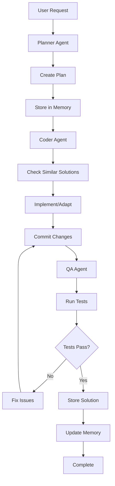

# Roadmap Detalhado para Evolução do SupaDupaCode CLI

## Visão Futura do Projeto

O SupaDupaCode CLI evoluirá para um sistema com:
- **3 agentes padrão configuráveis**: Planner, Coder e QA
- **Memória compartilhada otimizada** com banco de dados local
- **Integração com múltiplas APIs** (OpenAI, Anthropic, modelos locais)
- **Autonomia completa** através do MCP para commits e operações
- **Sistema de cache** para reuso de soluções anteriores

### Convenções Globais

#### Prefixos e Namespaces
- **Prefixo do Projeto**: `sd` (supadupacode)
- **Variáveis Globais**: `SD_*` (ex: `SD_MAX_AGENTS`, `SD_MEMORY_PATH`)
- **Constantes**: `SD_*` (ex: `SD_EVENT_PLAN_CREATED`, `SD_DEFAULT_TIMEOUT`)
- **Nomes Reservados**:
  - `sdAgent*` para classes de agentes
  - `sdMemory*` para classes de memória
  - `sdAPI*` para classes de API
  - `sdMCP*` para classes MCP
  - `sdWorkflow*` para classes de workflow

#### Contratos Compartilhados
```typescript
// shared/contracts/agent-config.ts
interface AgentConfigSchema {
  id: string;
  name: string;
  type: 'planner' | 'coder' | 'qa';
  capabilities: string[];
  api: {
    provider: string;
    model: string;
    endpoint: string;
    credentials: Record<string, string>;
  };
  tools: string[];
  systemPrompt: string;
  settings: Record<string, any>;
}

// shared/contracts/memory-record.ts
interface MemoryRecordDTO {
  id: string;
  key: string;
  category: string;
  data: any;
  metadata: {
    agentOrigin: string;
    embeddingVector?: number[];
    tags: string[];
    timestamp: string;
  };
}

// shared/contracts/plan-schema.ts
interface PlannerPlanDTO {
  planId: string;
  description: string;
  steps: PlannerStepDTO[];
  artifacts: string[];
  metadata: {
    createdAt: string;
    estimatedDuration: number;
    dependencies: string[];
  };
}

interface PlannerStepDTO {
  id: string;
  name: string;
  type: string;
  agent: string;
  description: string;
  dependencies: string[];
  expectedOutputs: string[];
}
```

## Divisão Operacional (4 AI Devs)

### Dev 1: Planner Core
- **Pasta Principal**: `cli/src/agents/planner/`
- **Objetivos Paralelos**:
  - Criar módulo `plan-orchestrator.ts` expondo `createExecutionPlan(planInput: PlannerInputDTO): PlannerPlanDTO`
  - Armazenar queue local em `plannerExecutionQueue`
  - Definir prompts em `prompts/planner/system/v1.md`
  - Produzir saída padrão `planner/output/plan_v1.json`
- **Artefatos Esperados**:
  - `cli/src/agents/planner/plan-orchestrator.ts`
  - `cli/src/agents/planner/queue.ts`
  - `cli/prompts/planner/system/v1.md`
  - `cli/planner/output/plan_v1.json`
- **Marcos de Sincronização**:
  - Contrato JSON de plano definido em `shared/contracts/plan-schema.ts`
  - Evento `SD_EVENT_PLAN_CREATED` emitido via EventEmitter

### Dev 2: Memória & Cache
- **Pasta Principal**: `cli/src/memory/`
- **Objetivos Paralelos**:
  - Implementar `MemoryRepository` com métodos `putMemoryRecord`, `fetchSimilarRecords`
  - Usar tabela SQLite `memory_records` com colunas `record_id`, `agent_origin`, `embedding_vector`
  - Expor `memoryClient` singleton em `cli/src/memory/index.ts`
  - Arquivos de seed em `data/seed/memory/init_records.json`
- **Artefatos Esperados**:
  - `cli/src/memory/memory-repository.ts`
  - `cli/src/memory/index.ts`
  - `cli/data/seed/memory/init_records.json`
  - Schema SQLite atualizado
- **Marcos de Sincronização**:
  - Endpoint `memory/cache/index.ts` com método `getCachedSolution(cacheKey: CacheKey)`
  - Contrato `MemoryRecordDTO` compartilhado

### Dev 3: Integrações API
- **Pasta Principal**: `cli/src/api/`
- **Objetivos Paralelos**:
  - Construir camada `ProviderRegistry` com mapa `providerAdapters: Record<ProviderId, ProviderAdapter>`
  - Interface `ProviderAdapter.execute(request: LlmRequest): Promise<LlmResponse>`
  - Arquivos de credenciais em `.env.example`
  - Testes de limite com fixtures `tests/api/mocks/provider-responses/*.json`
- **Artefatos Esperados**:
  - `cli/src/api/provider-registry.ts`
  - `cli/src/api/providers/base-provider.ts`
  - `cli/.env.example`
  - `cli/tests/api/mocks/provider-responses/`
- **Marcos de Sincronização**:
  - Constantes de eventos em `shared/constants/api-events.ts`
  - Eventos `SD_EVENT_PLAN_CREATED`, `SD_EVENT_BUILD_READY`

### Dev 4: Workflow & MCP
- **Pasta Principal**: `cli/src/workflow/` e `cli/src/mcp/`
- **Objetivos Paralelos**:
  - Escrever motor `WorkflowRunner` com funções `runStep`, `persistCheckpoint`
  - Padronizar commits via MCP endpoint `mcp/git/commit`
  - Reportar resultado em `workflow/reports/run-summary.json`
  - Scripts de automação em `scripts/workflow/run-checkpoint.ps1`
- **Artefatos Esperados**:
  - `cli/src/workflow/workflow-runner.ts`
  - `cli/src/mcp/servers/git-server.ts`
  - `cli/workflow/reports/run-summary.json`
  - `cli/scripts/workflow/run-checkpoint.ps1`
- **Marcos de Sincronização**:
  - Notificação QA via arquivo `qa/input/test_manifest.json`
  - Checkpoints persistidos em `data/checkpoints/`

## Dev Tracks

### Dev Planner Core (cli/src/agents/planner/)
- **Módulo Principal**: `plan-orchestrator.ts`
- **Função Principal**: `createExecutionPlan(planInput: PlannerInputDTO): PlannerPlanDTO`
- **Queue Local**: `plannerExecutionQueue`
- **Prompts**: `prompts/planner/system/v1.md`
- **Saída Padrão**: `planner/output/plan_v1.json`

### Dev Memória & Cache (cli/src/memory/)
- **Módulo Principal**: `MemoryRepository`
- **Métodos Principais**: `putMemoryRecord`, `fetchSimilarRecords`
- **Tabela SQLite**: `memory_records` com colunas `record_id`, `agent_origin`, `embedding_vector`
- **Singleton**: `memoryClient` em `cli/src/memory/index.ts`
- **Seed Data**: `data/seed/memory/init_records.json`

### Dev Integrações API (cli/src/api/)
- **Módulo Principal**: `ProviderRegistry`
- **Estrutura**: `providerAdapters: Record<ProviderId, ProviderAdapter>`
- **Interface**: `ProviderAdapter.execute(request: LlmRequest): Promise<LlmResponse>`
- **Credenciais**: `.env.example`
- **Testes**: `tests/api/mocks/provider-responses/*.json`

### Dev Workflow & MCP (cli/src/workflow/ e cli/src/mcp/)
- **Módulo Principal**: `WorkflowRunner`
- **Funções**: `runStep`, `persistCheckpoint`
- **Commits**: MCP endpoint `mcp/git/commit`
- **Relatórios**: `workflow/reports/run-summary.json`
- **Automação**: `scripts/workflow/run-checkpoint.ps1`

## Pontos de Sincronia

### Contrato JSON de Plano
```typescript
// shared/contracts/plan-schema.ts
interface PlannerPlanDTO {
  planId: string;
  steps: PlannerStepDTO[];
  artifacts: string[];
  metadata: {
    createdAt: string;
    estimatedDuration: number;
  };
}
```

### Endpoint de Cache Compartilhado
```typescript
// memory/cache/index.ts
export class CacheClient {
  async getCachedSolution(cacheKey: CacheKey): Promise<Solution | null> {
    // Implementação compartilhada entre Coder e QA
  }
}
```

### Constantes de Eventos API
```typescript
// shared/constants/api-events.ts
export const API_EVENTS = {
  EVENT_PLAN_CREATED: 'api:plan:created',
  EVENT_BUILD_READY: 'api:build:ready',
  EVENT_TEST_COMPLETED: 'api:test:completed'
};
```

### Manifesto de Testes QA
```typescript
// qa/input/test_manifest.json (gerado pelo Coder)
{
  "testSuites": ["unit", "integration", "e2e"],
  "expectedArtifacts": [
    "src/auth/login.js",
    "src/auth/validation.js"
  ],
  "testConfig": {
    "coverageThreshold": 80,
    "timeout": 30000
  }
}
```

## Testes e Qualidade

### Convenção de Suites
- **planner.spec.ts**: Testes unitários para o módulo planner
- **memory.integration.spec.ts**: Testes de integração para memória
- **provider.registry.spec.ts**: Testes para registry de providers
- **workflow.e2e.spec.ts**: Testes end-to-end para workflow

### Mocks Compartilhados
```typescript
// tests/__fixtures__/memoryRecords.ts
export function buildMemoryRecord({ overrides = {} }) {
  return {
    id: 'test-record-001',
    key: 'user-authentication',
    category: 'solutions',
    data: {
      problem: 'Implement user login',
      solution: 'JWT-based authentication'
    },
    metadata: {
      agentOrigin: 'planner',
      tags: ['auth', 'security'],
      timestamp: new Date().toISOString()
    },
    ...overrides
  };
}
```

### Estrutura de Testes
```
tests/
├── __fixtures__/
│   ├── memoryRecords.ts
│   ├── agentConfigs.ts
│   └── apiResponses.ts
├── agents/
│   ├── planner.spec.ts
│   ├── coder.spec.ts
│   └── qa.spec.ts
├── memory/
│   ├── memory-manager.spec.ts
│   └── memory.integration.spec.ts
├── api/
│   ├── provider-registry.spec.ts
│   └── api-manager.spec.ts
├── mcp/
│   ├── mcp-client.spec.ts
│   └── servers.spec.ts
└── workflow/
    ├── workflow-runner.spec.ts
    └── workflow.e2e.spec.ts
```

## Arquitetura Futura

```
┌─────────────────────────────────────────────────────────────────┐
│                    SupaDupaCode CLI v2.0                       │
│                 Orquestrador Multi-Agente Autônomo              │
└─────────────────────────────────────────────────────────────────┘
                                │
                                ▼
┌─────────────────────────────────────────────────────────────────┐
│                      Agentes Configuráveis                      │
│  ┌─────────────┐  ┌─────────────┐  ┌─────────────┐  ┌─────────┐ │
│  │   Planner   │  │    Coder    │  │     QA      │  │ Custom  │ │
│  │   (API)     │  │   (API)     │  │   (API)     │  │ (API)   │ │
│  └─────────────┘  └─────────────┘  └─────────────┘  └─────────┘ │
└─────────────────────────────────────────────────────────────────┘
                                │
                                ▼
┌─────────────────────────────────────────────────────────────────┐
│                    Memória Compartilhada                         │
│  ┌─────────────────────────────────────────────────────────────┐ │
│  │              Database de Conhecimento                       │ │
│  │  • Soluções anteriores                                     │ │
│  │  • Padrões de código                                       │ │
│  │  • Contexto do projeto                                     │ │
│  │  • Histórico de decisões                                   │ │
│  └─────────────────────────────────────────────────────────────┘ │
└─────────────────────────────────────────────────────────────────┘
                                │
                                ▼
┌─────────────────────────────────────────────────────────────────┐
│                      Integrações MCP                            │
│  ┌─────────────┐  ┌─────────────┐  ┌─────────────┐  ┌─────────┐ │
│  │ Filesystem  │  │     Git     │  │    Test     │  │  Build  │ │
│  │   Server    │  │   Server    │  │   Server    │  │ Server  │ │
│  └─────────────┘  └─────────────┘  └─────────────┘  └─────────┘ │
└─────────────────────────────────────────────────────────────────┘
```

## Divisão de Responsabilidades (4 Desenvolvedores IA)

### Dev 1: Agent Architecture
- **Pasta Principal**: `src/agents/`
- **Responsabilidades**: Arquitetura e implementação dos agentes
- **Módulos**: BaseAgent, AgentRegistry, AgentFactory, APIAgent
- **Variáveis Prefixo**: `AGENT_`, `REGISTRY_`, `FACTORY_`

### Dev 2: Memory & Database
- **Pasta Principal**: `src/memory/`
- **Responsabilidades**: Sistema de memória compartilhada
- **Módulos**: Database, MemoryManager, Cache, Schemas
- **Variáveis Prefixo**: `MEMORY_`, `DB_`, `CACHE_`, `SCHEMA_`

### Dev 3: API Integration
- **Pasta Principal**: `src/api/`
- **Responsabilidades**: Integração com APIs externas
- **Módulos**: APIManager, Providers, RateLimiting
- **Variáveis Prefixo**: `API_`, `PROVIDER_`, `RATE_`

### Dev 4: MCP & Workflow
- **Pasta Principal**: `src/mcp/` e `src/workflow/`
- **Responsabilidades**: MCP e automação de fluxos
- **Módulos**: MCP Servers, Workflow Engine, Checkpoints
- **Variáveis Prefixo**: `MCP_`, `WORKFLOW_`, `CHECKPOINT_`

## Convenções e Padronização

### Convenções de Nomenclatura

#### Variáveis Globais
```javascript
// Prefixos por módulo para evitar conflitos
const AGENT_REGISTRY_INSTANCE = Symbol('agent-registry');
const MEMORY_DB_INSTANCE = Symbol('memory-db');
const API_MANAGER_INSTANCE = Symbol('api-manager');
const MCP_SERVER_INSTANCE = Symbol('mcp-server');

// Configurações globais
const GLOBAL_CONFIG = {
  MAX_AGENTS: 10,
  MEMORY_RETENTION_DAYS: 30,
  API_TIMEOUT: 30000,
  MCP_SERVER_PORT: 3000
};
```

#### Estrutura de Pastas
```
src/
├── agents/              # Dev 1: Agent Architecture
│   ├── base-agent.js
│   ├── agent-registry.js
│   ├── agent-factory.js
│   ├── api-agent.js
│   ├── planner-agent.js
│   ├── coder-agent.js
│   └── qa-agent.js
├── memory/              # Dev 2: Memory & Database
│   ├── database.js
│   ├── memory-manager.js
│   ├── cache.js
│   ├── schemas/
│   │   ├── project-schema.js
│   │   ├── solution-schema.js
│   │   └── decision-schema.js
│   └── migrations/
│       └── 001-initial-schema.sql
├── api/                 # Dev 3: API Integration
│   ├── api-manager.js
│   ├── rate-limiter.js
│   └── providers/
│       ├── base-provider.js
│       ├── openai-provider.js
│       ├── anthropic-provider.js
│       └── local-provider.js
├── mcp/                 # Dev 4: MCP & Workflow
│   ├── mcp-client.js
│   └── servers/
│       ├── filesystem-server.js
│       ├── git-server.js
│       ├── test-server.js
│       └── build-server.js
└── workflow/            # Dev 4: Workflow
    ├── workflow-engine.js
    ├── checkpoint-manager.js
    └── task-executor.js
```

### Contratos de Interface

#### Interface BaseAgent (Dev 1)
```javascript
// src/agents/base-agent.js
export class BaseAgent {
  constructor(config, apiManager, memoryManager) {
    this.id = this.generateAgentId();
    this.config = config;
    this.apiManager = apiManager;
    this.memoryManager = memoryManager;
    this.capabilities = config.capabilities || [];
    this.tools = config.tools || [];
  }

  async initialize() {
    // Método para inicialização do agente
  }

  async execute(task) {
    // Método principal de execução
    // Deve retornar: { success: boolean, result: any, metadata: object }
  }

  async validate(task) {
    // Método para validar se o agente pode executar a tarefa
  }

  async cleanup() {
    // Método para limpeza de recursos
  }

  generateAgentId() {
    return `agent_${Date.now()}_${Math.random().toString(36).substr(2, 9)}`;
  }
}
```

#### Interface MemoryManager (Dev 2)
```javascript
// src/memory/memory-manager.js
export class MemoryManager {
  constructor(config) {
    this.dbPath = config.dbPath || './data/memory.db';
    this.cacheSize = config.cacheSize || 1000;
    this.dbInstance = null;
    this.cache = new Map();
  }

  async initialize() {
    // Inicializar conexão com banco de dados
  }

  async store(key, data, category) {
    // Armazenar dados na memória
  }

  async retrieve(key, category) {
    // Recuperar dados da memória
  }

  async search(query, category, limit = 10) {
    // Buscar dados por query
  }

  async clear(category = null) {
    // Limpar dados da memória
  }

  async getStats() {
    // Obter estatísticas de uso
  }
}
```

#### Interface APIManager (Dev 3)
```javascript
// src/api/api-manager.js
export class APIManager {
  constructor(config) {
    this.providers = new Map();
    this.rateLimiter = new RateLimiter(config.rateLimit);
    this.fallbackChain = config.fallbackChain || [];
  }

  async registerProvider(name, provider) {
    // Registrar um provider de API
  }

  async call(providerName, endpoint, params, options = {}) {
    // Fazer chamada para API com rate limiting e fallback
  }

  async getAvailableProviders() {
    // Obter lista de providers disponíveis
  }

  async testProvider(providerName) {
    // Testar conexão com provider
  }
}
```

#### Interface MCPClient (Dev 4)
```javascript
// src/mcp/mcp-client.js
export class MCPClient {
  constructor(config) {
    this.servers = new Map();
    this.connections = new Map();
    this.messageId = 0;
  }

  async registerServer(name, serverConfig) {
    // Registrar servidor MCP
  }

  async connect(serverName) {
    // Conectar ao servidor MCP
  }

  async executeTool(serverName, toolName, params) {
    // Executar ferramenta via MCP
  }

  async subscribe(serverName, event, callback) {
    // Assinar eventos do servidor
  }

  async disconnect(serverName) {
    // Desconectar do servidor
  }
}
```

## Fluxo de Trabalho Autônomo



### Tabela de Handoffs entre Agentes

| Agente | Entrada | Saída | Arquivo Intermediário | Path |
|--------|---------|-------|----------------------|------|
| **Planner** | User Request (texto) | `PlannerPlanDTO` | `plan_v1.json` | `planner/output/plan_v1.json` |
| **Memory** | `PlannerPlanDTO` | Soluções similares | `cache_results.json` | `memory/cache/search_results.json` |
| **Coder** | `plan_v1.json` + cache | Código implementado | `patchset_*.diff` | `coder/build/patchset_{timestamp}.diff` |
| **MCP Git** | `patchset_*.diff` | Commit hash | `commit_info.json` | `mcp/git/commit_info.json` |
| **QA** | `commit_info.json` | Resultados dos testes | `test_results.json` | `qa/reports/test_results.json` |
| **Workflow** | `test_results.json` | Resumo final | `run-summary.json` | `workflow/reports/run-summary.json` |

#### Detalhes dos Handoffs

**1. Planner → Memory**
```typescript
// planner/output/plan_v1.json
{
  "planId": "plan_123456",
  "description": "Add user authentication",
  "steps": [
    {
      "id": "step_1",
      "name": "Design auth schema",
      "type": "planning",
      "agent": "planner",
      "description": "Create database schema for authentication"
    }
  ]
}
```

**2. Memory → Coder**
```typescript
// memory/cache/search_results.json
{
  "query": "user authentication",
  "results": [
    {
      "id": "sol_001",
      "problem": "User login system",
      "solution": "JWT-based authentication",
      "relevance": 0.85,
      "path": "memory/solutions/auth_jwt.json"
    }
  ]
}
```

**3. Coder → MCP Git**
```typescript
// coder/build/patchset_20231012_143022.diff
--- a/src/auth/login.js
+++ b/src/auth/login.js
@@ -0,0 +1,45 @@
+// JWT-based authentication implementation
+export class LoginService {
+  // Implementation details
+}
```

**4. MCP Git → QA**
```typescript
// mcp/git/commit_info.json
{
  "commitHash": "a1b2c3d4",
  "branch": "feature/user-auth",
  "files": [
    "src/auth/login.js",
    "src/auth/validation.js"
  ],
  "timestamp": "2023-10-12T14:30:22Z"
}
```

**5. QA → Workflow**
```typescript
// qa/reports/test_results.json
{
  "testSuite": "authentication",
  "passed": 15,
  "failed": 2,
  "coverage": 87,
  "artifacts": [
    "qa/reports/coverage.html",
    "qa/reports/test_log.txt"
  ]
}
```

**6. Workflow Final**
```typescript
// workflow/reports/run-summary.json
{
  "planId": "plan_123456",
  "status": "completed",
  "duration": 4520000,
  "agents": ["planner", "coder", "qa"],
  "artifacts": [
    "planner/output/plan_v1.json",
    "coder/build/patchset_20231012_143022.diff",
    "qa/reports/test_results.json"
  ],
  "success": true
}
```

## Fases de Implementação Detalhadas

### Fase 1: Refatoração da Arquitetura de Agentes (Dev 1)

**Objetivo:** Transformar agentes simulados em entidades configuráveis e extensíveis.

**Implementação Detalhada:**

#### 1.1 BaseAgent Refactoring
```javascript
// src/agents/base-agent.js
export class BaseAgent {
  constructor(config, apiManager, memoryManager) {
    // ID único do agente
    this.id = this.generateAgentId();
    
    // Configurações obrigatórias
    this.name = config.name;
    this.type = config.type || 'base';
    this.capabilities = config.capabilities || [];
    this.tools = config.tools || [];
    
    // Dependências injetadas
    this.apiManager = apiManager;
    this.memoryManager = memoryManager;
    
    // Estado interno
    this.status = 'idle';
    this.currentTask = null;
    this.metrics = {
      tasksCompleted: 0,
      tasksFailed: 0,
      totalExecutionTime: 0
    };
    
    // Configurações de API
    this.apiConfig = config.api || {};
    this.systemPrompt = config.systemPrompt || '';
    this.settings = config.settings || {};
  }

  async initialize() {
    try {
      // Validar configurações
      this.validateConfig();
      
      // Inicializar conexões
      if (this.apiConfig.provider) {
        await this.apiManager.registerProvider(
          `${this.name}-provider`,
          this.apiConfig
        );
      }
      
      // Carregar memória específica do agente
      await this.loadAgentMemory();
      
      this.status = 'ready';
      return { success: true, message: `Agent ${this.name} initialized` };
    } catch (error) {
      this.status = 'error';
      throw new Error(`Failed to initialize agent ${this.name}: ${error.message}`);
    }
  }

  async execute(task) {
    const startTime = Date.now();
    this.status = 'executing';
    this.currentTask = task;
    
    try {
      // Validar tarefa
      if (!this.canExecute(task)) {
        throw new Error(`Agent ${this.name} cannot execute task: ${task.type}`);
      }
      
      // Preparar contexto
      const context = await this.prepareContext(task);
      
      // Executar lógica específica do agente
      const result = await this.processTask(task, context);
      
      // Armazenar resultado na memória
      await this.storeResult(task, result);
      
      // Atualizar métricas
      this.updateMetrics(true, Date.now() - startTime);
      
      this.status = 'completed';
      return {
        success: true,
        result,
        metadata: {
          agentId: this.id,
          executionTime: Date.now() - startTime,
          timestamp: new Date().toISOString()
        }
      };
    } catch (error) {
      this.updateMetrics(false, Date.now() - startTime);
      this.status = 'failed';
      throw error;
    } finally {
      this.currentTask = null;
    }
  }

  canExecute(task) {
    return this.capabilities.includes(task.type);
  }

  async prepareContext(task) {
    // Buscar contexto relevante da memória
    const relevantMemory = await this.memoryManager.search(
      task.description,
      'solutions',
      5
    );
    
    return {
      task,
      relevantMemory,
      agentHistory: await this.getAgentHistory(),
      projectContext: await this.memoryManager.retrieve('project', 'context')
    };
  }

  async processTask(task, context) {
    // Método abstrato - deve ser implementado por subclasses
    throw new Error('processTask must be implemented by subclass');
  }

  async storeResult(task, result) {
    await this.memoryManager.store(
      `${this.id}_${task.id}`,
      {
        task,
        result,
        agent: this.name,
        timestamp: new Date().toISOString()
      },
      'solutions'
    );
  }

  validateConfig() {
    const required = ['name', 'capabilities'];
    for (const field of required) {
      if (!this[field]) {
        throw new Error(`Required field missing: ${field}`);
      }
    }
  }

  generateAgentId() {
    return `agent_${this.name}_${Date.now()}_${Math.random().toString(36).substr(2, 9)}`;
  }

  updateMetrics(success, executionTime) {
    if (success) {
      this.metrics.tasksCompleted++;
    } else {
      this.metrics.tasksFailed++;
    }
    this.metrics.totalExecutionTime += executionTime;
  }

  async loadAgentMemory() {
    // Carregar memória específica do agente
    const agentMemory = await this.memoryManager.retrieve(this.id, 'agent-memory');
    if (agentMemory) {
      this.agentHistory = agentMemory.history || [];
      this.learnedPatterns = agentMemory.patterns || [];
    }
  }

  async getAgentHistory() {
    return this.agentHistory || [];
  }

  async cleanup() {
    this.status = 'cleaning';
    // Limpar recursos
    this.currentTask = null;
    this.status = 'idle';
  }
}
```

#### 1.2 AgentRegistry Implementation
```javascript
// src/agents/agent-registry.js
export class AgentRegistry {
  constructor(memoryManager) {
    this.agents = new Map();
    this.agentTypes = new Map();
    this.memoryManager = memoryManager;
    this.maxAgents = GLOBAL_CONFIG.MAX_AGENTS;
  }

  async registerAgent(agentConfig) {
    // Validar limite de agentes
    if (this.agents.size >= this.maxAgents) {
      throw new Error(`Maximum agent limit reached: ${this.maxAgents}`);
    }

    // Validar configuração
    this.validateAgentConfig(agentConfig);

    // Criar instância do agente
    const AgentClass = this.getAgentClass(agentConfig.type);
    const agent = new AgentClass(agentConfig, this.apiManager, this.memoryManager);

    // Inicializar agente
    await agent.initialize();

    // Registrar no mapa
    this.agents.set(agent.id, agent);
    this.agentTypes.set(agentConfig.name, agent.id);

    // Persistir registro
    await this.persistRegistry();

    return agent;
  }

  async unregisterAgent(agentId) {
    const agent = this.agents.get(agentId);
    if (!agent) {
      throw new Error(`Agent not found: ${agentId}`);
    }

    // Limpar agente
    await agent.cleanup();

    // Remover dos mapas
    this.agents.delete(agentId);
    this.agentTypes.delete(agent.name);

    // Persistir alterações
    await this.persistRegistry();

    return true;
  }

  getAgent(agentId) {
    return this.agents.get(agentId);
  }

  getAgentByName(name) {
    const agentId = this.agentTypes.get(name);
    return agentId ? this.agents.get(agentId) : null;
  }

  getAllAgents() {
    return Array.from(this.agents.values());
  }

  getAgentsByCapability(capability) {
    return Array.from(this.agents.values()).filter(
      agent => agent.capabilities.includes(capability)
    );
  }

  validateAgentConfig(config) {
    const required = ['name', 'type', 'capabilities'];
    for (const field of required) {
      if (!config[field]) {
        throw new Error(`Required field missing in agent config: ${field}`);
      }
    }

    // Verificar duplicidade
    if (this.agentTypes.has(config.name)) {
      throw new Error(`Agent name already exists: ${config.name}`);
    }
  }

  getAgentClass(type) {
    // Factory method para obter classe do agente
    switch (type) {
      case 'planner':
        return PlannerAgent;
      case 'coder':
        return CoderAgent;
      case 'qa':
        return QAAgent;
      default:
        throw new Error(`Unknown agent type: ${type}`);
    }
  }

  async persistRegistry() {
    const registryData = {
      agents: Array.from(this.agents.entries()).map(([id, agent]) => ({
        id,
        name: agent.name,
        type: agent.type,
        capabilities: agent.capabilities,
        status: agent.status
      })),
      timestamp: new Date().toISOString()
    };

    await this.memoryManager.store('agent-registry', registryData, 'system');
  }

  async loadRegistry() {
    const registryData = await this.memoryManager.retrieve('agent-registry', 'system');
    if (registryData) {
      // Reconstruir estado do registro
      for (const agentData of registryData.agents) {
        // Implementar lógica para reconstruir agentes
      }
    }
  }
}
```

### Fase 2: Sistema de Memória Compartilhada (Dev 2)

**Objetivo:** Implementar banco de dados para memória compartilhada entre agentes.

**Implementação Detalhada:**

#### 2.1 Database Schema
```sql
-- src/memory/migrations/001-initial-schema.sql

-- Tabela de contexto do projeto
CREATE TABLE IF NOT EXISTS project_context (
  id INTEGER PRIMARY KEY AUTOINCREMENT,
  key TEXT UNIQUE NOT NULL,
  value TEXT NOT NULL,
  category TEXT NOT NULL,
  created_at DATETIME DEFAULT CURRENT_TIMESTAMP,
  updated_at DATETIME DEFAULT CURRENT_TIMESTAMP
);

-- Tabela de soluções
CREATE TABLE IF NOT EXISTS solutions (
  id INTEGER PRIMARY KEY AUTOINCREMENT,
  problem_hash TEXT NOT NULL,
  problem TEXT NOT NULL,
  solution TEXT NOT NULL,
  code TEXT,
  agent_id TEXT NOT NULL,
  tags TEXT, -- JSON array
  success_rate REAL DEFAULT 0.0,
  usage_count INTEGER DEFAULT 0,
  created_at DATETIME DEFAULT CURRENT_TIMESTAMP,
  updated_at DATETIME DEFAULT CURRENT_TIMESTAMP
);

-- Tabela de decisões
CREATE TABLE IF NOT EXISTS decisions (
  id INTEGER PRIMARY KEY AUTOINCREMENT,
  context TEXT NOT NULL,
  decision TEXT NOT NULL,
  rationale TEXT NOT NULL,
  agent_id TEXT NOT NULL,
  task_id TEXT,
  created_at DATETIME DEFAULT CURRENT_TIMESTAMP
);

-- Tabela de memória de agentes
CREATE TABLE IF NOT EXISTS agent_memory (
  id INTEGER PRIMARY KEY AUTOINCREMENT,
  agent_id TEXT NOT NULL,
  memory_type TEXT NOT NULL, -- 'history', 'patterns', 'preferences'
  content TEXT NOT NULL, -- JSON content
  created_at DATETIME DEFAULT CURRENT_TIMESTAMP,
  updated_at DATETIME DEFAULT CURRENT_TIMESTAMP
);

-- Índices para performance
CREATE INDEX IF NOT EXISTS idx_solutions_problem_hash ON solutions(problem_hash);
CREATE INDEX IF NOT EXISTS idx_solutions_agent_id ON solutions(agent_id);
CREATE INDEX IF NOT EXISTS idx_solutions_tags ON solutions(tags);
CREATE INDEX IF NOT EXISTS idx_decisions_agent_id ON decisions(agent_id);
CREATE INDEX IF NOT EXISTS idx_agent_memory_agent_id ON agent_memory(agent_id);
```

#### 2.2 MemoryManager Implementation
```javascript
// src/memory/memory-manager.js
import sqlite3 from 'sqlite3';
import { open } from 'sqlite';
import path from 'path';

export class MemoryManager {
  constructor(config) {
    this.dbPath = config.dbPath || path.join(process.cwd(), 'data', 'memory.db');
    this.cacheSize = config.cacheSize || 1000;
    this.dbInstance = null;
    this.cache = new Map();
    this.cacheHits = 0;
    this.cacheMisses = 0;
  }

  async initialize() {
    try {
      // Abrir conexão com banco de dados
      this.dbInstance = await open({
        filename: this.dbPath,
        driver: sqlite3.Database
      });

      // Habilitar foreign keys
      await this.dbInstance.exec('PRAGMA foreign_keys = ON');

      // Criar tabelas se não existirem
      await this.runMigrations();

      console.log(`Memory database initialized: ${this.dbPath}`);
    } catch (error) {
      throw new Error(`Failed to initialize memory database: ${error.message}`);
    }
  }

  async store(key, data, category, metadata = {}) {
    try {
      const serializedData = JSON.stringify(data);
      const serializedMetadata = JSON.stringify(metadata);
      
      // Verificar cache
      const cacheKey = `${category}:${key}`;
      if (this.cache.size >= this.cacheSize) {
        this.evictOldestCacheEntry();
      }
      this.cache.set(cacheKey, {
        data: serializedData,
        metadata: serializedMetadata,
        timestamp: Date.now()
      });

      // Determinar tabela baseada na categoria
      const table = this.getCategoryTable(category);
      
      if (table === 'project_context') {
        await this.dbInstance.run(
          `INSERT OR REPLACE INTO project_context (key, value, category) VALUES (?, ?, ?)`,
          [key, serializedData, category]
        );
      } else if (table === 'solutions') {
        const problemHash = this.generateHash(key);
        await this.dbInstance.run(
          `INSERT OR REPLACE INTO solutions (problem_hash, problem, solution, code, agent_id, tags) 
           VALUES (?, ?, ?, ?, ?, ?)`,
          [
            problemHash,
            key,
            serializedData,
            data.code || null,
            metadata.agentId || 'unknown',
            JSON.stringify(metadata.tags || [])
          ]
        );
      } else if (table === 'decisions') {
        await this.dbInstance.run(
          `INSERT INTO decisions (context, decision, rationale, agent_id, task_id) 
           VALUES (?, ?, ?, ?, ?)`,
          [
            metadata.context || '',
            serializedData,
            metadata.rationale || '',
            metadata.agentId || 'unknown',
            metadata.taskId || null
          ]
        );
      } else if (table === 'agent_memory') {
        await this.dbInstance.run(
          `INSERT OR REPLACE INTO agent_memory (agent_id, memory_type, content) 
           VALUES (?, ?, ?)`,
          [key, category, serializedData]
        );
      }

      return { success: true, key, category };
    } catch (error) {
      throw new Error(`Failed to store data: ${error.message}`);
    }
  }

  async retrieve(key, category) {
    try {
      // Verificar cache primeiro
      const cacheKey = `${category}:${key}`;
      if (this.cache.has(cacheKey)) {
        this.cacheHits++;
        const cached = this.cache.get(cacheKey);
        return JSON.parse(cached.data);
      }

      this.cacheMisses++;

      // Buscar no banco de dados
      const table = this.getCategoryTable(category);
      let result = null;

      if (table === 'project_context') {
        result = await this.dbInstance.get(
          'SELECT value FROM project_context WHERE key = ? AND category = ?',
          [key, category]
        );
      } else if (table === 'solutions') {
        const problemHash = this.generateHash(key);
        result = await this.dbInstance.get(
          'SELECT solution FROM solutions WHERE problem_hash = ?',
          [problemHash]
        );
      } else if (table === 'decisions') {
        result = await this.dbInstance.get(
          'SELECT decision FROM decisions WHERE id = ?',
          [key]
        );
      } else if (table === 'agent_memory') {
        result = await this.dbInstance.get(
          'SELECT content FROM agent_memory WHERE agent_id = ? AND memory_type = ?',
          [key, category]
        );
      }

      if (result) {
        const data = JSON.parse(result.value || result.solution || result.decision || result.content);
        
        // Atualizar cache
        this.cache.set(cacheKey, {
          data: JSON.stringify(data),
          timestamp: Date.now()
        });

        return data;
      }

      return null;
    } catch (error) {
      throw new Error(`Failed to retrieve data: ${error.message}`);
    }
  }

  async search(query, category, limit = 10) {
    try {
      const table = this.getCategoryTable(category);
      let results = [];

      if (table === 'solutions') {
        // Busca por texto completo
        results = await this.dbInstance.all(
          `SELECT problem, solution, agent_id, tags, usage_count, success_rate 
           FROM solutions 
           WHERE problem LIKE ? OR solution LIKE ?
           ORDER BY usage_count DESC, success_rate DESC
           LIMIT ?`,
          [`%${query}%`, `%${query}%`, limit]
        );
      } else if (table === 'decisions') {
        results = await this.dbInstance.all(
          `SELECT context, decision, rationale, agent_id 
           FROM decisions 
           WHERE decision LIKE ? OR rationale LIKE ?
           ORDER BY created_at DESC
           LIMIT ?`,
          [`%${query}%`, `%${query}%`, limit]
        );
      }

      // Formatar resultados
      return results.map(row => ({
        ...row,
        tags: row.tags ? JSON.parse(row.tags) : [],
        relevance: this.calculateRelevance(query, row)
      }));
    } catch (error) {
      throw new Error(`Failed to search data: ${error.message}`);
    }
  }

  async updateUsageCount(solutionId) {
    try {
      await this.dbInstance.run(
        'UPDATE solutions SET usage_count = usage_count + 1 WHERE id = ?',
        [solutionId]
      );
    } catch (error) {
      console.error(`Failed to update usage count: ${error.message}`);
    }
  }

  async updateSuccessRate(solutionId, success) {
    try {
      const current = await this.dbInstance.get(
        'SELECT success_rate, usage_count FROM solutions WHERE id = ?',
        [solutionId]
      );

      if (current) {
        const newRate = ((current.success_rate * current.usage_count) + (success ? 1 : 0)) / (current.usage_count + 1);
        await this.dbInstance.run(
          'UPDATE solutions SET success_rate = ? WHERE id = ?',
          [newRate, solutionId]
        );
      }
    } catch (error) {
      console.error(`Failed to update success rate: ${error.message}`);
    }
  }

  getCategoryTable(category) {
    const categoryMap = {
      'context': 'project_context',
      'solutions': 'solutions',
      'decisions': 'decisions',
      'agent-memory': 'agent_memory',
      'history': 'agent_memory',
      'patterns': 'agent_memory',
      'preferences': 'agent_memory'
    };

    return categoryMap[category] || 'project_context';
  }

  generateHash(input) {
    // Implementar hash simples (pode ser substituído por crypto)
    let hash = 0;
    for (let i = 0; i < input.length; i++) {
      const char = input.charCodeAt(i);
      hash = ((hash << 5) - hash) + char;
      hash = hash & hash; // Convert to 32-bit integer
    }
    return hash.toString();
  }

  calculateRelevance(query, row) {
    // Implementar cálculo de relevância simples
    const queryLower = query.toLowerCase();
    const problemLower = (row.problem || '').toLowerCase();
    const solutionLower = (row.solution || '').toLowerCase();
    
    let score = 0;
    
    // Pontos por correspondência exata
    if (problemLower.includes(queryLower)) score += 10;
    if (solutionLower.includes(queryLower)) score += 5;
    
    // Pontos por taxa de sucesso
    score += (row.success_rate || 0) * 2;
    
    // Pontos por uso
    score += Math.min(row.usage_count || 0, 5);
    
    return score;
  }

  evictOldestCacheEntry() {
    let oldestKey = null;
    let oldestTime = Date.now();
    
    for (const [key, value] of this.cache.entries()) {
      if (value.timestamp < oldestTime) {
        oldestTime = value.timestamp;
        oldestKey = key;
      }
    }
    
    if (oldestKey) {
      this.cache.delete(oldestKey);
    }
  }

  async runMigrations() {
    // Implementar sistema de migrações
    const migrationPath = path.join(__dirname, 'migrations');
    // Lógica para executar migrações pendentes
  }

  async getStats() {
    return {
      cacheSize: this.cache.size,
      cacheHits: this.cacheHits,
      cacheMisses: this.cacheMisses,
      cacheHitRate: this.cacheHits / (this.cacheHits + this.cacheMisses) || 0
    };
  }

  async clear(category = null) {
    try {
      if (category) {
        const table = this.getCategoryTable(category);
        await this.dbInstance.run(`DELETE FROM ${table} WHERE category = ?`, [category]);
        
        // Limpar cache relacionado
        for (const [key] of this.cache.entries()) {
          if (key.startsWith(`${category}:`)) {
            this.cache.delete(key);
          }
        }
      } else {
        // Limpar tudo
        await this.dbInstance.exec('DELETE FROM project_context');
        await this.dbInstance.exec('DELETE FROM solutions');
        await this.dbInstance.exec('DELETE FROM decisions');
        await this.dbInstance.exec('DELETE FROM agent_memory');
        this.cache.clear();
      }
    } catch (error) {
      throw new Error(`Failed to clear memory: ${error.message}`);
    }
  }

  async close() {
    if (this.dbInstance) {
      await this.dbInstance.close();
    }
  }
}
```

### Fase 3: Integração com APIs de Modelos (Dev 3)

**Objetivo:** Conectar agentes a APIs de IA (OpenAI, Anthropic, modelos locais).

**Implementação Detalhada:**

#### 3.1 APIManager Implementation
```javascript
// src/api/api-manager.js
export class APIManager {
  constructor(config) {
    this.providers = new Map();
    this.rateLimiter = new RateLimiter(config.rateLimit);
    this.fallbackChain = config.fallbackChain || [];
    this.defaultTimeout = config.timeout || 30000;
    this.maxRetries = config.maxRetries || 3;
    this.circuitBreakers = new Map();
  }

  async registerProvider(name, providerConfig) {
    try {
      // Validar configuração
      this.validateProviderConfig(providerConfig);
      
      // Criar provider
      const ProviderClass = this.getProviderClass(providerConfig.type);
      const provider = new ProviderClass(providerConfig);
      
      // Inicializar provider
      await provider.initialize();
      
      // Testar conexão
      await this.testProviderConnection(provider);
      
      // Registrar circuit breaker
      this.circuitBreakers.set(name, new CircuitBreaker(provider, {
        threshold: 5,
        timeout: 60000
      }));
      
      // Registrar provider
      this.providers.set(name, {
        instance: provider,
        config: providerConfig,
        priority: providerConfig.priority || 0,
        available: true
      });
      
      console.log(`Provider registered successfully: ${name}`);
      return true;
    } catch (error) {
      console.error(`Failed to register provider ${name}: ${error.message}`);
      throw error;
    }
  }

  async call(providerName, endpoint, params, options = {}) {
    const startTime = Date.now();
    let lastError = null;
    
    try {
      // Verificar rate limiting
      await this.rateLimiter.checkLimit(providerName);
      
      // Obter provider
      const provider = this.providers.get(providerName);
      if (!provider || !provider.available) {
        throw new Error(`Provider not available: ${providerName}`);
      }
      
      // Executar com circuit breaker
      const circuitBreaker = this.circuitBreakers.get(providerName);
      const result = await circuitBreaker.execute(async () => {
        return await provider.instance.call(endpoint, params, {
          timeout: options.timeout || this.defaultTimeout,
          ...options
        });
      });
      
      // Registrar sucesso
      this.recordMetrics(providerName, true, Date.now() - startTime);
      
      return result;
    } catch (error) {
      lastError = error;
      
      // Registrar falha
      this.recordMetrics(providerName, false, Date.now() - startTime);
      
      // Tentar fallback se configurado
      if (options.useFallback !== false && this.fallbackChain.length > 0) {
        return await this.tryFallback(providerName, endpoint, params, options);
      }
      
      throw error;
    }
  }

  async tryFallback(failedProvider, endpoint, params, options) {
    const fallbackProviders = this.fallbackChain.filter(
      name => name !== failedProvider && this.providers.has(name)
    );
    
    for (const providerName of fallbackProviders) {
      try {
        console.log(`Trying fallback provider: ${providerName}`);
        return await this.call(providerName, endpoint, params, {
          ...options,
          useFallback: false // Evitar fallback infinito
        });
      } catch (error) {
        console.warn(`Fallback provider ${providerName} also failed: ${error.message}`);
        continue;
      }
    }
    
    throw new Error(`All providers failed for endpoint: ${endpoint}`);
  }

  async testProvider(providerName) {
    const provider = this.providers.get(providerName);
    if (!provider) {
      throw new Error(`Provider not found: ${providerName}`);
    }
    
    try {
      const result = await provider.instance.test();
      return { success: true, result };
    } catch (error) {
      return { success: false, error: error.message };
    }
  }

  async testProviderConnection(provider) {
    // Implementar teste de conexão específico do provider
    if (provider.test) {
      await provider.test();
    }
  }

  validateProviderConfig(config) {
    const required = ['type', 'endpoint'];
    for (const field of required) {
      if (!config[field]) {
        throw new Error(`Required field missing in provider config: ${field}`);
      }
    }
  }

  getProviderClass(type) {
    switch (type) {
      case 'openai':
        return OpenAIProvider;
      case 'anthropic':
        return AnthropicProvider;
      case 'local':
        return LocalProvider;
      default:
        throw new Error(`Unknown provider type: ${type}`);
    }
  }

  recordMetrics(providerName, success, duration) {
    // Implementar registro de métricas
    const metrics = {
      provider: providerName,
      success,
      duration,
      timestamp: new Date().toISOString()
    };
    
    // Enviar para sistema de métricas
    // metrics.record('api_call', metrics);
  }

  getAvailableProviders() {
    return Array.from(this.providers.entries())
      .filter(([_, provider]) => provider.available)
      .map(([name, provider]) => ({
        name,
        type: provider.config.type,
        priority: provider.priority
      }));
  }

  async getProviderStats(providerName) {
    const circuitBreaker = this.circuitBreakers.get(providerName);
    return {
      available: this.providers.get(providerName)?.available || false,
      circuitState: circuitBreaker?.getState(),
      metrics: this.getProviderMetrics(providerName)
    };
  }

  getProviderMetrics(providerName) {
    // Implementar retorno de métricas do provider
    return {
      totalCalls: 0,
      successfulCalls: 0,
      failedCalls: 0,
      averageResponseTime: 0
    };
  }
}
```

#### 3.2 OpenAI Provider
```javascript
// src/api/providers/openai-provider.js
import fetch from 'node-fetch';

export class OpenAIProvider {
  constructor(config) {
    this.apiKey = config.apiKey;
    this.endpoint = config.endpoint || 'https://api.openai.com/v1';
    this.model = config.model || 'gpt-4';
    this.timeout = config.timeout || 30000;
    this.maxRetries = config.maxRetries || 3;
  }

  async initialize() {
    if (!this.apiKey) {
      throw new Error('OpenAI API key is required');
    }
    
    // Testar conexão
    await this.test();
  }

  async call(endpoint, params, options = {}) {
    const url = `${this.endpoint}${endpoint}`;
    const payload = {
      model: this.model,
      ...params
    };

    let lastError = null;
    
    for (let attempt = 0; attempt <= this.maxRetries; attempt++) {
      try {
        const response = await fetch(url, {
          method: 'POST',
          headers: {
            'Authorization': `Bearer ${this.apiKey}`,
            'Content-Type': 'application/json',
            ...options.headers
          },
          body: JSON.stringify(payload),
          timeout: options.timeout || this.timeout
        });

        if (!response.ok) {
          const error = await response.json();
          throw new Error(`OpenAI API error: ${error.error?.message || response.statusText}`);
        }

        const data = await response.json();
        return this.formatResponse(data);
      } catch (error) {
        lastError = error;
        
        // Não tentar novamente para certos erros
        if (this.isNonRetryableError(error)) {
          throw error;
        }
        
        // Esperar antes de tentar novamente
        if (attempt < this.maxRetries) {
          await this.delay(Math.pow(2, attempt) * 1000); // Exponential backoff
        }
      }
    }
    
    throw lastError;
  }

  async test() {
    try {
      const response = await this.call('/chat/completions', {
        messages: [{ role: 'user', content: 'Test connection' }],
        max_tokens: 5
      });
      return { success: true, response };
    } catch (error) {
      throw new Error(`OpenAI connection test failed: ${error.message}`);
    }
  }

  formatResponse(data) {
    // Formatar resposta padrão da OpenAI
    if (data.choices && data.choices.length > 0) {
      return {
        content: data.choices[0].message.content,
        usage: data.usage,
        model: data.model,
        finishReason: data.choices[0].finish_reason
      };
    }
    
    return data;
  }

  isNonRetryableError(error) {
    const nonRetryableCodes = ['invalid_api_key', 'insufficient_quota'];
    return nonRetryableCodes.some(code => error.message.includes(code));
  }

  delay(ms) {
    return new Promise(resolve => setTimeout(resolve, ms));
  }
}
```

### Fase 4: Automação Completa com MCP (Dev 4)

**Objetivo:** Implementar MCP real para operações autônomas.

**Implementação Detalhada:**

#### 4.1 MCP Client Implementation
```javascript
// src/mcp/mcp-client.js
import { EventEmitter } from 'events';
import WebSocket from 'ws';

export class MCPClient extends EventEmitter {
  constructor(config) {
    super();
    this.servers = new Map();
    this.connections = new Map();
    this.messageId = 0;
    this.pendingRequests = new Map();
    this.config = config;
    this.reconnectAttempts = new Map();
    this.maxReconnectAttempts = 5;
  }

  async registerServer(name, serverConfig) {
    try {
      // Validar configuração
      this.validateServerConfig(serverConfig);
      
      // Registrar servidor
      this.servers.set(name, {
        name,
        config: serverConfig,
        status: 'disconnected',
        tools: new Map(),
        capabilities: [],
        lastHeartbeat: null
      });
      
      // Tentar conectar
      await this.connect(name);
      
      console.log(`MCP server registered: ${name}`);
      return true;
    } catch (error) {
      console.error(`Failed to register MCP server ${name}: ${error.message}`);
      throw error;
    }
  }

  async connect(serverName) {
    const server = this.servers.get(serverName);
    if (!server) {
      throw new Error(`Server not found: ${serverName}`);
    }

    try {
      // Criar conexão WebSocket
      const ws = new WebSocket(server.config.endpoint);
      
      // Configurar handlers
      ws.on('open', () => this.handleConnectionOpen(serverName, ws));
      ws.on('message', (data) => this.handleMessage(serverName, data));
      ws.on('close', () => this.handleConnectionClose(serverName));
      ws.on('error', (error) => this.handleConnectionError(serverName, error));
      
      // Armazenar conexão
      this.connections.set(serverName, ws);
      server.status = 'connecting';
      
      // Aguardar handshake
      await this.waitForHandshake(serverName);
      
      // Descobrir ferramentas
      await this.discoverTools(serverName);
      
      server.status = 'connected';
      server.lastHeartbeat = Date.now();
      
      this.emit('serverConnected', serverName);
      console.log(`Connected to MCP server: ${serverName}`);
    } catch (error) {
      server.status = 'error';
      throw new Error(`Failed to connect to MCP server ${serverName}: ${error.message}`);
    }
  }

  async executeTool(serverName, toolName, params, options = {}) {
    const server = this.servers.get(serverName);
    const connection = this.connections.get(serverName);
    
    if (!server || !connection) {
      throw new Error(`Server not connected: ${serverName}`);
    }
    
    if (server.status !== 'connected') {
      throw new Error(`Server not ready: ${serverName} (status: ${server.status})`);
    }
    
    // Verificar se ferramenta existe
    if (!server.tools.has(toolName)) {
      throw new Error(`Tool not found: ${toolName} on server: ${serverName}`);
    }
    
    const messageId = this.generateMessageId();
    const message = {
      id: messageId,
      method: 'tools/call',
      params: {
        name: toolName,
        arguments: params
      }
    };
    
    // Criar promise para resposta
    const promise = new Promise((resolve, reject) => {
      const timeout = setTimeout(() => {
        this.pendingRequests.delete(messageId);
        reject(new Error(`Tool execution timeout: ${toolName}`));
      }, options.timeout || 30000);
      
      this.pendingRequests.set(messageId, {
        resolve,
        reject,
        timeout,
        timestamp: Date.now()
      });
    });
    
    // Enviar requisição
    connection.send(JSON.stringify(message));
    
    // Aguardar resposta
    return await promise;
  }

  async subscribe(serverName, event, callback) {
    const server = this.servers.get(serverName);
    const connection = this.connections.get(serverName);
    
    if (!server || !connection) {
      throw new Error(`Server not connected: ${serverName}`);
    }
    
    const messageId = this.generateMessageId();
    const message = {
      id: messageId,
      method: 'notifications/subscribe',
      params: {
        event
      }
    };
    
    // Registrar callback
    const eventKey = `${serverName}:${event}`;
    if (!this.listeners(eventKey)) {
      this.on(eventKey, callback);
    }
    
    // Enviar subscrição
    connection.send(JSON.stringify(message));
    
    return messageId;
  }

  handleConnectionOpen(serverName, ws) {
    const server = this.servers.get(serverName);
    console.log(`WebSocket connection opened: ${serverName}`);
    
    // Enviar handshake
    const handshake = {
      id: this.generateMessageId(),
      method: 'initialize',
      params: {
        protocolVersion: '2024-11-05',
        capabilities: {
          tools: {},
          notifications: {}
        },
        clientInfo: {
          name: 'supadupacode-cli',
          version: '2.0.0'
        }
      }
    };
    
    ws.send(JSON.stringify(handshake));
  }

  handleMessage(serverName, data) {
    try {
      const message = JSON.parse(data.toString());
      
      if (message.id && this.pendingRequests.has(message.id)) {
        // Resposta para requisição pendente
        const pending = this.pendingRequests.get(message.id);
        clearTimeout(pending.timeout);
        this.pendingRequests.delete(message.id);
        
        if (message.error) {
          pending.reject(new Error(message.error.message));
        } else {
          pending.resolve(message.result);
        }
      } else if (message.method) {
        // Notificação ou evento
        this.handleNotification(serverName, message);
      }
    } catch (error) {
      console.error(`Failed to handle message from ${serverName}:`, error);
    }
  }

  handleNotification(serverName, message) {
    const eventKey = `${serverName}:${message.method}`;
    this.emit(eventKey, message.params);
  }

  handleConnectionClose(serverName) {
    const server = this.servers.get(serverName);
    server.status = 'disconnected';
    
    // Tentar reconectar
    this.scheduleReconnect(serverName);
    
    this.emit('serverDisconnected', serverName);
    console.log(`MCP server disconnected: ${serverName}`);
  }

  handleConnectionError(serverName, error) {
    const server = this.servers.get(serverName);
    server.status = 'error';
    
    this.emit('serverError', serverName, error);
    console.error(`MCP server error ${serverName}:`, error);
  }

  async waitForHandshake(serverName) {
    return new Promise((resolve, reject) => {
      const timeout = setTimeout(() => {
        reject(new Error(`Handshake timeout: ${serverName}`));
      }, 10000);
      
      const handler = (eventName) => {
        if (eventName === 'initialized') {
          clearTimeout(timeout);
          this.removeListener('serverConnected', handler);
          resolve();
        }
      };
      
      this.on('serverConnected', handler);
    });
  }

  async discoverTools(serverName) {
    try {
      const result = await this.executeTool(serverName, 'tools/list', {});
      const server = this.servers.get(serverName);
      
      if (result.tools) {
        for (const tool of result.tools) {
          server.tools.set(tool.name, tool);
        }
      }
      
      console.log(`Discovered ${server.tools.size} tools for server: ${serverName}`);
    } catch (error) {
      console.error(`Failed to discover tools for ${serverName}:`, error);
    }
  }

  scheduleReconnect(serverName) {
    const attempts = this.reconnectAttempts.get(serverName) || 0;
    
    if (attempts >= this.maxReconnectAttempts) {
      console.error(`Max reconnect attempts reached for: ${serverName}`);
      return;
    }
    
    const delay = Math.pow(2, attempts) * 1000; // Exponential backoff
    this.reconnectAttempts.set(serverName, attempts + 1);
    
    setTimeout(async () => {
      try {
        await this.connect(serverName);
        this.reconnectAttempts.set(serverName, 0); // Reset attempts on success
      } catch (error) {
        console.error(`Reconnect failed for ${serverName}:`, error);
        this.scheduleReconnect(serverName);
      }
    }, delay);
  }

  validateServerConfig(config) {
    const required = ['endpoint'];
    for (const field of required) {
      if (!config[field]) {
        throw new Error(`Required field missing in server config: ${field}`);
      }
    }
  }

  generateMessageId() {
    return `msg_${Date.now()}_${++this.messageId}`;
  }

  async disconnect(serverName) {
    const connection = this.connections.get(serverName);
    if (connection) {
      connection.close();
      this.connections.delete(serverName);
    }
    
    const server = this.servers.get(serverName);
    if (server) {
      server.status = 'disconnected';
    }
    
    // Cancelar requisições pendentes
    for (const [messageId, pending] of this.pendingRequests.entries()) {
      clearTimeout(pending.timeout);
      pending.reject(new Error('Connection closed'));
      this.pendingRequests.delete(messageId);
    }
  }

  async shutdown() {
    // Desconectar todos os servidores
    for (const serverName of this.servers.keys()) {
      await this.disconnect(serverName);
    }
    
    this.servers.clear();
    this.connections.clear();
    this.removeAllListeners();
  }
}
```

## Configuração de Ambiente

### Variáveis de Ambiente por Módulo

```bash
# Configurações Globais
SUPADUPACODE_ENV=development
SUPADUPACODE_LOG_LEVEL=info
SUPADUPACODE_DATA_PATH=./data

# Dev 1: Agent Architecture
AGENT_MAX_AGENTS=10
AGENT_DEFAULT_TIMEOUT=30000
AGENT_HEARTBEAT_INTERVAL=5000

# Dev 2: Memory & Database
MEMORY_DB_PATH=./data/memory.db
MEMORY_CACHE_SIZE=1000
MEMORY_RETENTION_DAYS=30
MEMORY_BACKUP_INTERVAL=3600000

# Dev 3: API Integration
API_DEFAULT_TIMEOUT=30000
API_MAX_RETRIES=3
API_RATE_LIMIT_REQUESTS=100
API_RATE_LIMIT_WINDOW=60000
API_OPENAI_ENDPOINT=https://api.openai.com/v1
API_ANTHROPIC_ENDPOINT=https://api.anthropic.com/v1

# Dev 4: MCP & Workflow
MCP_SERVER_HOST=localhost
MCP_SERVER_PORT=3000
MCP_MAX_RECONNECT_ATTEMPTS=5
MCP_HEARTBEAT_INTERVAL=10000
WORKFLOW_MAX_CONCURRENT_TASKS=5
WORKFLOW_CHECKPOINT_INTERVAL=30000
```

## Estrutura de Pastas Detalhada

```
cli/
├── src/
│   ├── agents/              # Dev 1: Agent Architecture
│   │   ├── base-agent.js
│   │   ├── agent-registry.js
│   │   ├── agent-factory.js
│   │   ├── api-agent.js
│   │   ├── planner-agent.js
│   │   ├── coder-agent.js
│   │   ├── qa-agent.js
│   │   └── utils/
│   │       ├── agent-validator.js
│   │       └── agent-metrics.js
│   ├── memory/              # Dev 2: Memory & Database
│   │   ├── database.js
│   │   ├── memory-manager.js
│   │   ├── cache.js
│   │   ├── schemas/
│   │   │   ├── project-schema.js
│   │   │   ├── solution-schema.js
│   │   │   └── decision-schema.js
│   │   ├── migrations/
│   │   │   ├── 001-initial-schema.sql
│   │   │   └── migration-runner.js
│   │   └── utils/
│   │       ├── hash-utils.js
│   │       └── search-index.js
│   ├── api/                 # Dev 3: API Integration
│   │   ├── api-manager.js
│   │   ├── rate-limiter.js
│   │   ├── circuit-breaker.js
│   │   ├── providers/
│   │   │   ├── base-provider.js
│   │   │   ├── openai-provider.js
│   │   │   ├── anthropic-provider.js
│   │   │   └── local-provider.js
│   │   └── utils/
│   │       ├── retry-handler.js
│   │       └── response-formatter.js
│   ├── mcp/                 # Dev 4: MCP & Workflow
│   │   ├── mcp-client.js
│   │   ├── servers/
│   │   │   ├── filesystem-server.js
│   │   │   ├── git-server.js
│   │   │   ├── test-server.js
│   │   │   └── build-server.js
│   │   └── utils/
│   │       ├── message-handler.js
│   │       └── protocol-validator.js
│   └── workflow/            # Dev 4: Workflow
│       ├── workflow-engine.js
│       ├── checkpoint-manager.js
│       ├── task-executor.js
│       └── utils/
│           ├── task-queue.js
│           └── state-manager.js
├── data/                    # Banco de dados e cache
│   ├── memory.db
│   ├── cache/
│   └── checkpoints/
├── plugins/                 # Agentes personalizados
├── prompts/                 # System prompts
├── tests/                   # Testes por módulo
│   ├── agents/
│   ├── memory/
│   ├── api/
│   ├── mcp/
│   └── workflow/
└── docs/                    # Documentação
    ├── api/
    ├── memory/
    ├── mcp/
    └── workflow/
```

## Contratos de Comunicação Entre Módulos

### Eventos Globais
```javascript
// Eventos emitidos pelo sistema
const GLOBAL_EVENTS = {
  // Agent events
  'agent:registered': { agent: Object },
  'agent:unregistered': { agentId: String },
  'agent:task:started': { agentId: String, task: Object },
  'agent:task:completed': { agentId: String, result: Object },
  'agent:task:failed': { agentId: String, error: Error },
  
  // Memory events
  'memory:item:stored': { key: String, category: String },
  'memory:item:retrieved': { key: String, category: String, data: Object },
  'memory:search:completed': { query: String, results: Array },
  
  // API events
  'api:call:started': { provider: String, endpoint: String },
  'api:call:completed': { provider: String, result: Object },
  'api:call:failed': { provider: String, error: Error },
  
  // MCP events
  'mcp:server:connected': { serverName: String },
  'mcp:server:disconnected': { serverName: String },
  'mcp:tool:executed': { serverName: String, tool: String, result: Object },
  
  // Workflow events
  'workflow:task:queued': { task: Object },
  'workflow:task:started': { taskId: String },
  'workflow:task:completed': { taskId: String, result: Object },
  'workflow:checkpoint:created': { checkpointId: String, state: Object }
};
```

## Conclusão

Este plano detalhado fornece uma implementação completa e modular que permite que 4 desenvolvedores de IA trabalhem em paralelo sem conflitos, com responsabilidades claramente definidas, interfaces padronizadas e convenções de nomenclatura consistentes.