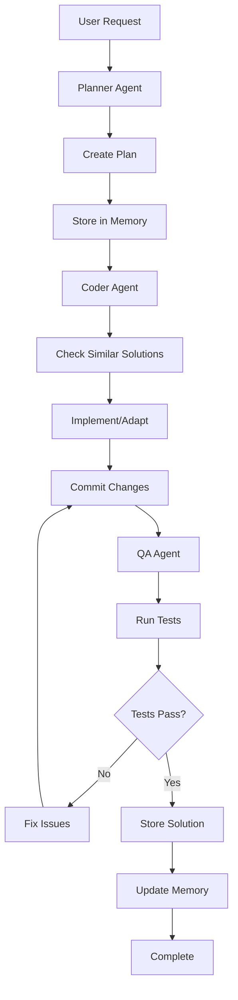

# Roadmap para Evolução do SupaDupaCode CLI

## Visão Futura do Projeto

O SupaDupaCode CLI evoluirá para um sistema com:
- **3 agentes padrão configuráveis**: Planner, Coder e QA
- **Memória compartilhada otimizada** com banco de dados local
- **Integração com múltiplas APIs** (OpenAI, Anthropic, modelos locais)
- **Autonomia completa** através do MCP para commits e operações
- **Sistema de cache** para reuso de soluções anteriores

## Arquitetura Futura

```
┌─────────────────────────────────────────────────────────────────┐
│                    SupaDupaCode CLI v2.0                       │
│                 Orquestrador Multi-Agente Autônomo              │
└─────────────────────────────────────────────────────────────────┘
                                │
                                ▼
┌─────────────────────────────────────────────────────────────────┐
│                      Agentes Configuráveis                      │
│  ┌─────────────┐  ┌─────────────┐  ┌─────────────┐  ┌─────────┐ │
│  │   Planner   │  │    Coder    │  │     QA      │  │ Custom  │ │
│  │   (API)     │  │   (API)     │  │   (API)     │  │ (API)   │ │
│  └─────────────┘  └─────────────┘  └─────────────┘  └─────────┘ │
└─────────────────────────────────────────────────────────────────┘
                                │
                                ▼
┌─────────────────────────────────────────────────────────────────┐
│                    Memória Compartilhada                         │
│  ┌─────────────────────────────────────────────────────────────┐ │
│  │              Database de Conhecimento                       │ │
│  │  • Soluções anteriores                                     │ │
│  │  • Padrões de código                                       │ │
│  │  • Contexto do projeto                                     │ │
│  │  • Histórico de decisões                                   │ │
│  └─────────────────────────────────────────────────────────────┘ │
└─────────────────────────────────────────────────────────────────┘
                                │
                                ▼
┌─────────────────────────────────────────────────────────────────┐
│                      Integrações MCP                            │
│  ┌─────────────┐  ┌─────────────┐  ┌─────────────┐  ┌─────────┐ │
│  │ Filesystem  │  │     Git     │  │    Test     │  │  Build  │ │
│  │   Server    │  │   Server    │  │   Server    │  │ Server  │ │
│  └─────────────┘  └─────────────┘  └─────────────┘  └─────────┘ │
└─────────────────────────────────────────────────────────────────┘
```

## Fases de Implementação

### Fase 1: Refatoração da Arquitetura de Agentes

**Objetivo:** Transformar agentes simulados em entidades configuráveis e extensíveis.

**Tarefas:**
- Refatorar BaseAgent para suportar configuração dinâmica
- Implementar AgentRegistry para gerenciar agentes configuráveis
- Criar sistema de plugins para agentes personalizados
- Desenvolver AgentFactory para criar agentes a partir de configurações

**Arquivos a modificar/criar:**
- `src/agents/base-agent.js` - Refatorar para suporte a APIs
- `src/agents/agent-registry.js` - Novo: Registro de agentes
- `src/agents/agent-factory.js` - Novo: Fábrica de agentes
- `src/agents/api-agent.js` - Novo: Agente base para APIs

### Fase 2: Sistema de Memória Compartilhada

**Objetivo:** Implementar banco de dados para memória compartilhada entre agentes.

**Tarefas:**
- Selecionar e implementar banco de dados leve (SQLite ou DuckDB)
- Criar schema para armazenamento de conhecimento
- Implementar MemoryManager para acesso otimizado
- Desenvolver sistema de cache para performance

**Arquivos a criar:**
- `src/memory/memory-manager.js` - Gerenciador de memória
- `src/memory/database.js` - Camada de abstração do DB
- `src/memory/schemas.js` - Definições de schema
- `src/memory/cache.js` - Sistema de cache

### Fase 3: Integração com APIs de Modelos

**Objetivo:** Conectar agentes a APIs de IA (OpenAI, Anthropic, modelos locais).

**Tarefas:**
- Implementar APIManager para gerenciar múltiplas APIs
- Criar adapters para diferentes provedores
- Desenvolver sistema de rate limiting e retry
- Implementar fallback entre APIs

**Arquivos a criar:**
- `src/api/api-manager.js` - Gerenciador de APIs
- `src/api/providers/` - Diretório para adapters
  - `openai-adapter.js`
  - `anthropic-adapter.js`
  - `local-adapter.js`
- `src/api/rate-limiter.js` - Controle de rate limiting

### Fase 4: Automação Completa com MCP

**Objetivo:** Implementar MCP real para operações autônomas.

**Tarefas:**
- Implementar MCP servers reais
- Conectar agentes ao MCP
- Automatizar fluxos de trabalho
- Implementar sistema de checkpoints

**Arquivos a modificar/criar:**
- `src/mcp/mcp-client.js` - Implementar protocolo real
- `src/mcp/servers/` - Implementações de servers
  - `filesystem-server.js`
  - `git-server.js`
  - `test-server.js`

### Fase 5: Otimização e Performance

**Objetivo:** Otimizar performance e implementar recursos avançados.

**Tarefas:**
- Otimizar consultas ao banco de dados
- Implementar sistema de streaming para respostas longas
- Adicionar métricas avançadas
- Implementar sistema de observabilidade

## Arquitetura Detalhada

### 1. Sistema de Agentes Configuráveis

Exemplo de configuração de agente:

```json
{
  "name": "planner",
  "type": "api-agent",
  "api": {
    "provider": "openai",
    "model": "gpt-4",
    "endpoint": "https://api.openai.com/v1",
    "credentials": {
      "apiKey": "${OPENAI_API_KEY}"
    }
  },
  "capabilities": ["planning", "decomposition", "analysis"],
  "tools": ["filesystem", "git", "memory"],
  "systemPrompt": "You are a software architect...",
  "settings": {
    "temperature": 0.1,
    "maxTokens": 4000
  }
}
```

### 2. Sistema de Memória Compartilhada

Estrutura da memória:

```json
{
  "projectContext": {
    "name": "project-name",
    "description": "...",
    "techStack": ["node.js", "react"],
    "conventions": {...}
  },
  "solutions": [
    {
      "problem": "user authentication",
      "solution": "...",
      "code": "...",
      "agent": "coder",
      "timestamp": "...",
      "tags": ["auth", "security", "jwt"]
    }
  ],
  "decisions": [
    {
      "context": "...",
      "decision": "...",
      "rationale": "...",
      "agent": "planner",
      "timestamp": "..."
    }
  ]
}
```

### 3. Fluxo de Trabalho Autônomo



## Implementação Prioritária

### Primeiro MVP

**Agentes Básicos Configuráveis**
- Planner, Coder, QA com suporte a APIs
- Sistema de registro dinâmico

**Memória Compartilhada Básica**
- SQLite para armazenamento
- Sistema de cache simples
- Busca por soluções similares

**MCP Básico**
- Filesystem e Git servers
- Operações de commit automatizadas

### Segundo MVP

**APIs Múltiplas**
- Suporte a OpenAI, Anthropic, modelos locais
- Rate limiting e fallback

**Memória Avançada**
- Sistema de embeddings para busca semântica
- Cache inteligente

**Automação Completa**
- Fluxos de trabalho autônomos
- Checkpoints e recuperação

## Configuração de Ambiente

### Variáveis de Ambiente

```bash
# APIs
OPENAI_API_KEY=your_openai_key
ANTHROPIC_API_KEY=your_anthropic_key

# Database
DATABASE_PATH=./data/supadupacode.db

# Performance
CACHE_SIZE=1000
MEMORY_RETENTION_DAYS=30

# MCP
MCP_SERVER_HOST=localhost
MCP_SERVER_PORT=3000
```

## Estrutura de Diretórios Futura

```
cli/
├── src/
│   ├── agents/          # Agentes configuráveis
│   ├── api/             # Gerenciamento de APIs
│   ├── memory/          # Sistema de memória
│   ├── mcp/             # MCP servers reais
│   └── workflow/        # Automação de fluxos
├── data/                # Banco de dados local
│   ├── memory.db
│   └── cache/
├── plugins/             # Agentes personalizados
└── prompts/             # System prompts
```

## Métricas de Sucesso

- **Autonomia**: % de tarefas concluídas sem intervenção humana
- **Performance**: Tempo médio de resolução de problemas
- **Qualidade**: Taxa de aprovação em testes automatizados
- **Reuso**: % de soluções reutilizadas da memória
- **Eficiência**: Redução no tempo de desenvolvimento

## Conclusão

Este roadmap transforma o atual SupaDupaCode CLI em um orquestrador multi-agente verdadeiramente autônomo, com memória compartilhada otimizada, integração com múltiplas APIs e operações completamente automatizadas através do MCP, mantendo foco em performance e eficiência.